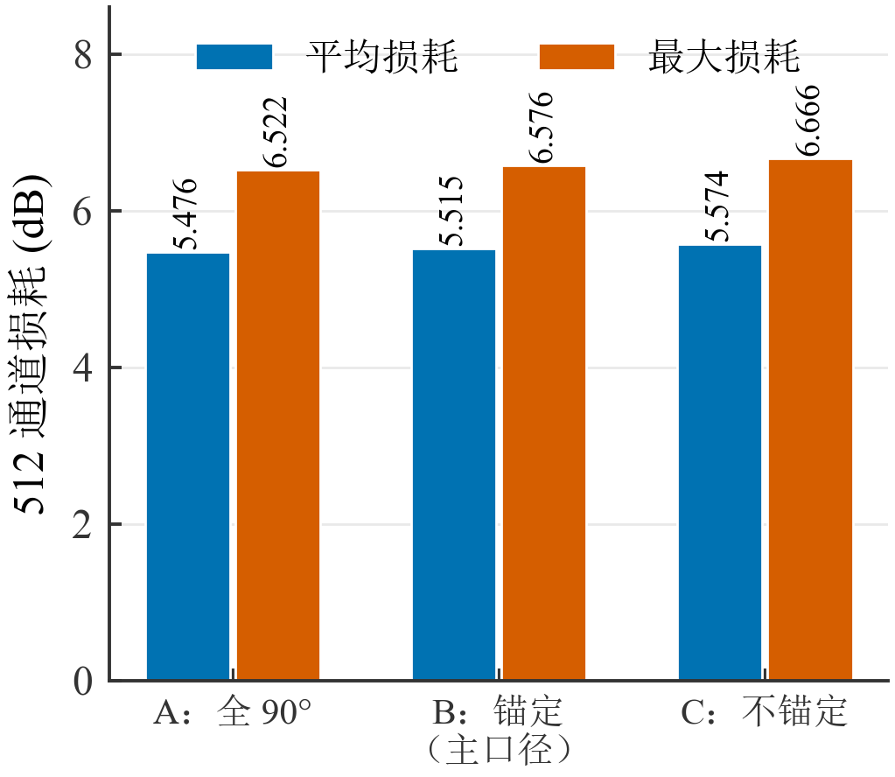

# 二维光波导自动布线总体实验报告

**范围：二维（256 / 512 通道）。三维内容仅在第 8.6 节作为后续方向简述，不进入任何二维结果表。**

编制日期：2026-10-05　　数据截止：Step 14（`outputs/opt2d_step14/`）

本报告只整理与核查已经完成的二维实验产物，没有修改路由代码、输入、实验参数或历史记录，也没有重新运行优化去追求更好的数字。全部数字来自已保存的 CSV / JSON / XLSX 产物，每张表下的"数据来源"给出可直接打开的路径。

## 摘要

二维自动布线工作围绕一个具体问题展开：**在前代论文给定的端口规模、板尺寸、线宽、间距与损耗模型下，能否在保持全部连接布通的前提下降低计算损耗，并控制小角度交叉与近并行间距不足带来的几何风险。**

已完成的工作按研究问题分为四条线。第一条是**原程序复现**：把前代 AutoRouter 的输入、轨道分配、直线与圆弧构造以及 GDSII 输出在 Python 3.10 上重建，并与从 `AutoRouter.exe` 解包出的原始字节码逐阶段比对。第二条是**半径与轨道搜索**：在做统一评价器后，比较原版 R5、统一 R6、候选轨道搜索、自适应 R5/R6 四种方案。第三条是**路径结构**：冻结端点后引入自由弯角 S 形路径，用更小的总转弯角度换取更低的弯曲损耗。第四条是**风险与保护**：冻结逐路半径与固定保护集合，比较间距、小角度交叉与两者的组合，并做保护性局部重布。

主要结论如下。

- **复现可靠性较高，但集中于几何与非交叉损耗。** 512 通道从输入工作簿到 GDSII 的全部阶段与原可执行程序字节码逐位一致（512/512 路线轨道相同、弯曲列全部相同、GDS 路径点阵与宽度相同，仅 8 个时间戳字节不同）。256/512/512-R4 三组复现损耗与原报告差在一位小数印刷精度以内。**但交叉损耗的原始数据表在本机不可得**，现用论文图 3-12 数字化加 90° 文字值锚定的近似表，绝对值不可信。
- **半径是第一杠杆。** 512 通道重新布线后平均损耗由 R5 的 5.5162 dB 降到 R6 的 4.5582 dB（−17.4%），收益几乎全部来自弯曲损耗（4.5587 → 3.5995 dB）；代价是统一 R6 在 512 上有 2 条路线几何不可行。
- **轨道搜索的算法收益很小。** 候选轨道优化相对原版只改善 −0.0014 dB（256）/ −0.0016 dB（512），约 −0.03%。原因是两弯 U 型结构下弯角与半径固定，轨道位置只能影响占总损耗 2.5%（256）/ 5.8%（512）的交叉项。
- **路径结构的收益最大，代价也最大。** 冻结端点后，自由弯角 S 形（F56）把 256 平均损耗从 5.2778 降到 2.9703 dB、512 从 5.5167 降到 3.2947 dB，最差链路同时改善；代价是小角度交叉与间距违规大幅增加（512 的间距违规由 711 增到 1231）。
- **几何修复更正了旧的"无重合"结论。** 复核发现旧版求交把一处真实重合误判为交叉：256 通道 F56 的路线 #7 与 #31 斜线段共线，重叠 152.007142675 mm。修复后重新布线，该方案平均损耗只升 0.0014 dB。旧的"全部方案无重合、无几何违规"与旧的 256 接触数、平均总弯角均已更正。
- **冻结半径后，约束配置的收益集中在尾部风险。** 标称口径下三种约束的改善都在 0.03 dB 以内；把小于 20° 的交叉损耗放大到 10 倍，`small` 配置把最大损耗压低 0.7749 dB（256）/ 0.9504 dB（512），代价是平均上升 0.0283 / 0.0545 dB。
- **保护性局部优化在两个规模上结果相反。** 512 接受 6 个候选，压力情景最大损耗下降 0.0924 dB、标称平均还改善 0.0011 dB，11 条保护路线逐条不劣化；**256 在严格口径下 0 接受**（68 个候选全部被拒）。
- **仍有明确边界。** 512 的保护性优化在 ×10 压力情景下几乎没有改善（8.4996 vs 8.4333 dB，反而略升）；局部恢复只有固定案例的离线沙箱验证；1024 是合成扩容输入，真实 1024 端口数据尚未提供，不计入本报告的真实二维验证。

> 全部损耗都是现有损耗模型的计算值，不是器件实测值。平均、最大与 P95 描述的是一次布局内各条路线的统计，不是重复实验统计。运行时间若只有一次记录，只描述该次实测。
<!-- pagebreak -->
# 目录

1. 研究对象与实验条件
2. 原程序复现及几何一致性
3. 半径、轨道与自适应半径实验
4. 固定端点与自由弯角路径
5. 几何修复与统计口径
6. 冻结公平对照与保护性优化
7. 排序、多交叉防护与局部恢复
8. 总体结论与局限
附录 A　二维实验总表
附录 B　实验资料索引
附录 C　表格与图—原始数据对应关系
附录 D　阅读提示与口径速查

<!-- pagebreak -->
# 1 研究对象与实验条件

本章确定后面所有比较的共同前提：端口规模与连接输入是什么，端点坐标从哪里来，板面、线宽、间距与半径如何设定，损耗怎么算，以及资料里的编号如何解读。**不同端点来源、不同半径或不同评价器下的数字不能直接放在同一个公平比较里**，因此这些条件必须先讲清楚。

## 1.1 端口规模与连接输入

二维工作只涉及两个规模：**256 通道**与 **512 通道**。连接关系来自原项目的两个工作簿，每个工作簿只有两列端口编号与若干行连线，不含坐标：

表1 端口规模与连接输入
| 规模 | 连接输入 | 连接数 | 端口组织 | 每端口波导 | 坐标来源 |
| --- | --- | ---: | --- | ---: | --- |
| 256 | `OpticalWaveguideRouter2D/data/fiberBoard256.xlsx` | 256 | 32 个 PMT | 16 | 无经核验的独立坐标快照 |
| 512 | `OpticalWaveguideRouter2D/data/fiberBoard512.xlsx` | 512 | 64 个 PMT | 16 | 2020 年历史坐标快照已核验 |

512 的连接表含 64 个 PMT、每个 16 个端点，合计 1024 个端点。256 的连接表含 32 个 PMT，合计 512 个端点，但其中只有 256 条连接。

数据来源：`OpticalWaveguideRouter3D/docs/reports/step_8_legacy_input_validation.md`、`OpticalWaveguideRouter3D/docs/reports/step_8_legacy_layout_audit.md`、`OpticalWaveguideRouter3D/docs/2d_routing/parameters_and_ports.md`。

## 1.2 端点布局的三种来源必须区分

本报告涉及三类端点坐标，它们的证据强度完全不同，混用会直接导致错误的"公平对照"。

**第一类：真实连接表。** 即 1.1 节的两个工作簿。它们给出的是"哪个端口连到哪个端口"，是真实输入，但**不含任何 x/y 坐标或端口槽位号**。

**第二类：历史坐标快照。** 512 通道存在一份 2020 年的历史快照 `fiberBoard0data.xlsx`，其端口坐标已逐行核验。令 `c = 0..31` 为该侧从左到右的 PMT 列号、`j = 0..15` 为组内按 x 升序的几何序位：

表2 512 通道端点坐标快照公式
| 侧 | 坐标（mm） |
| --- | --- |
| 下边（y = 0） | (2 + 4.5c + 0.175j, 0) |
| 上边（y = 150） | (4 + 4.5c + 0.175j, 150) |

同侧 PMT 起点间距 4.5 mm，上下两侧横向错开 2 mm；下边端点 x 范围为 2～144.125 mm，上边为 4～146.125 mm。需要保留两条限制：几何序位 `j` 由快照坐标推得，**不等于原始端口槽位 ID**，快照中的 `index1/index2` 也不是槽位；原布局生成程序与完整槽位分配规则尚未恢复。**256 通道没有对应的、经过核验的独立坐标快照**，不能把 512 的公式截取一半当作 256 的排布。

**第三类：算法生成布局。** 优化实验（Step 12 起）中被比较的几何，都是路由器在给定输入下生成的路线，不是外部提供的坐标。其中 Step 13 起改为**冻结端点**：以方案 A（原版 R5 几何）的最终 `sx/sy/lx/ly` 作为输入，逐路固定，端口槽位交换关闭（`allow_port_reorder=False`）。因此 Step 12 与 Step 13 及之后的对照**不能直接混用**：Step 12 允许通过交换同端口槽位来满足出线顺序，Step 13 起不允许。

数据来源：`OpticalWaveguideRouter3D/docs/reports/step_8_legacy_512_snapshot.md`、`step_8_legacy_layout_audit.md`、`step_13_opt2d_fixed_endpoints_and_freeform.md` 第 1 节。

## 1.3 板面、线宽、间距、弯曲半径与路线类型

表3 板面、线宽、间距与半径参数
| 参数 | 256 通道 | 512 通道 | 证据状态 |
| --- | ---: | ---: | --- |
| 布线区域 | 150 × 150 mm | 150 × 150 mm | 复现与优化实验一致 |
| 波导宽度 | 0.05 mm（50 μm） | 0.05 mm（50 μm） | 已核验 |
| 标称边缘间隔 | 0.25 mm（250 μm） | 0.125 mm（125 μm） | 已核验；是布线输入的节距规则 |
| 轨道中心节距 | 0.30 mm | 0.175 mm | 宽度加间隔 |
| 弯曲半径（主口径） | 前代论文 5 mm 配置 | 5 mm | 512 已核验；256 独立半径未确认 |
| 对照半径 | R6 = 6 mm | R6 = 6 mm | 已有实测弯曲损耗数据的档位 |
| 候选轨道数 | 按同一规则生成 | 800 | 512 已核验 |

三点必须说明。

第一，**标称间隔是布线输入的节距规则，不等于所有曲线之间的实际边缘距离都满足它**。原版程序只用 `noCross` 的端口顺序启发式，没有显式间距规则，也没有制造依据支持某个具体阈值。因此本报告中的"间距违规"统计采用"线宽 + 标称间隔"作为**实验假设阈值**（256 为 0.30 mm、512 为 0.175 mm），只保证不劣于原版轨道栅格的标称值，**不代表制造规范**。

第二，**512 的轨道中心从 `radius + width/2` 到 `board_height - radius - width/2`**，在 150 mm 板高、5 mm 半径下生成 800 个候选轨道。实测复现栅格的两端为 **5.0 mm 与 144.825 mm**（步距 0.175 mm，共 800 条），与 `r + w/2 = 5.025 mm` 略有差别；3D 侧 opt2d 的 G1 栅格起点确为 5.025 mm，两者是不同口径。现有 512 快照得到 **454 条普通路线**的轨道分配结果，另有 **58 条特殊 Z 形**路线只有解析几何、没有普通轨道。"有解析几何"不等于"获得普通轨道"。

第三，**路线类型**分三类：同侧连接使用 U 型（两段 90° 圆弧加中间直线，或在 `dx < 2R` 时两段非完整圆弧在中点相接）；跨上下两侧的连接在 Step 13 之前同样按两弯结构构造；Step 13 起新增**自由弯角 S 形**，几何为"直线引出段 + 圆弧（转角 α）+ 斜向直线 + 圆弧（转角 −α）+ 直线引入段"，端点切线仍垂直于板边，半径候选限定 R5/R6。

数据来源：`OpticalWaveguideRouter3D/docs/2d_routing/parameters_and_ports.md`、`step_8_legacy_512_track_assignment_v01.md`、`step_12_opt2d_2d_routing_optimization.md` 第 2.1、2.4 节、`step_13_opt2d_fixed_endpoints_and_freeform.md` 第 3 节。

## 1.4 损耗模型与评价口径

当前二维损耗按"每条波导分别计算、以 dB 相加"处理：

表4 损耗模型分量与参数来源
| 分量 | 模型 | 参数来源 | 可信度 |
| --- | --- | --- | --- |
| 传播（直线） | 长度（cm）× 0.05 dB/cm | 前代论文表 2-1 | 参数为印刷值，非本项目实测 |
| 弯曲 | 弧长 × 弯曲密度；等价于 `L90 × θ/90°` | 原版程序内硬编码的 `tl/ll` 表 | 与论文表 3-1 五位吻合，来自论文引用的实验室数据 |
| 交叉 | 交叉角查表，每事件按两根波导各计一次 | 论文图 3-12 数字化 + 90° 文字值锚定 | **近似**：原版交叉表本机不可得 |

弯曲损耗模型的关键数字：R5 对应 **2.3826 dB/90°**，R6 对应 **1.9037 dB/90°**（论文表 3-1 印为 2.39 与 1.90，是原始密度的四舍五入）。代码按实际弯角线性缩放。

交叉损耗模型需要单独强调三点。其一，原版 `calc_loss` 从**外部传入**的 DataFrame 取交叉损耗，该表没有随 EXE 发布，经过 PYZ 解包、EXE 二进制、随附压缩包与整个项目目录的穷尽搜索均未找到，因此**原版交叉表在本机不可得**。其二，现用表由论文图 3-12 的 "cross number 30" 曲线数字化得到，并用论文文字"90° 时 30 个交叉约 0.05 dB"把整条曲线按 `0.05/0.0593` 缩放锚定；原图曲线抖动约 0.1 dB，远大于单次交叉损耗（0.0017 dB），故**只有趋势可信、绝对高度不可信**。其三，所有对照都用同一张表，没有通过更换表制造收益。

评价口径方面，本报告统一采用**解析物理统计**：求交覆盖直—直、直—弧、弧—弧，每对曲线返回全部交点，交叉角由交点处两条曲线的**真实切线**给出；同一对波导在**不同位置**的交叉点全部保留，同一位置的重复几何记录按坐标聚类合并。原版 `calc_index` 的口径（弦近似求交与整数度查表）只作为参照，不混入同一组数字。两套口径的平均损耗差在 0.0014 dB 以内（约 0.03%），但**最小交叉角差异显著**：512 解析口径为 23.07°，原版口径为 14.0°。

数据来源：`OpticalWaveguideRouter2D/docs/loss_model_reconstruction_report.md` 第 3–7、12 节；`OpticalWaveguideRouter2D/data/crossing_loss_from_thesis_fig3_12.csv`；`OpticalWaveguideRouter3D/publication/tables/t34_crossing_model_sensitivity_data.csv`。

数据来源：`OpticalWaveguideRouter2D/data/crossing_loss_from_thesis_fig3_12.csv`；`OpticalWaveguideRouter2D/results/fiberBoard512_loss.xlsx`；汇总见 `OpticalWaveguideRouter3D/publication/tables/t34_crossing_model_sensitivity_data.csv`。

## 1.5 编号与术语：R5/R6 是半径，不是实验序号

资料中同时存在两套容易混淆的编号，必须先分清。

表5 编号与术语对照
| 写法 | 含义 | 所在位置 |
| --- | --- | --- |
| **R5** | 弯曲半径 5 mm | 方案名、图中参数 |
| **R6** | 弯曲半径 6 mm | 方案名、图中参数 |
| **R05 / R06** | **实验清单编号**，分别指 512 通道半径 2 mm 与 3 mm 的扫描实验 | 早期实验清单 |
| **F56** | 自由弯角路径 + 从 5/6 mm 半径中选择；**不是 56 mm 半径** | Step 13 起 |
| **F5** | 自由弯角路径，只用 R5 | Step 13 起 |
| **R5U** | 冻结端点下的 U 型路径，半径固定 R5 | Step 13 起 |
| **D0 / D56** | 简单半径回退（R6 优先、不可行回退 R5，单候选）/ 多候选自适应 R5R6 | Step 13 起 |
| **A / B / C / D** | 原版 R5 / 统一 R6 重新布线 / 候选轨道优化 / 局部自适应 R5R6 | Step 12 |
| **base / spacing / small / touch / both / opt_base** | 冻结半径下的六种配置 | Step 14 |

"R 是半径"这一条同时解释了后续章节的一个关键区分：**把半径从 5 mm 改成 6 mm 是参数改动，把候选选择从"取第一个可用轨道"改成"枚举并评分"是算法改动**，两类收益必须分开报告（见 3.5 节）。

数据来源：`OpticalWaveguideRouter3D/publication/report/实验结果简明说明.md` 第 1 节；`OpticalWaveguideRouter3D/docs/reports/step_12_opt2d_2d_routing_optimization.md` 第 3 节；`step_13_opt2d_fixed_endpoints_and_freeform.md` 第 2、3 节。

## 1.6 本章汇总：实验条件与证据等级

表6 实验条件与证据等级汇总
| 项目 | 256 通道 | 512 通道 | 证据等级 |
| --- | --- | --- | --- |
| 连接关系 | 真实连接表 | 真实连接表 | 已核验 |
| 端点坐标 | 未重建独立布局 | 2020 历史快照 | 512 已核验；256 缺失 |
| 板尺寸与线宽 | 150 × 150 mm，0.05 mm | 150 × 150 mm，0.05 mm | 已核验 |
| 标称间隔 | 0.25 mm | 0.125 mm | 已核验（输入规则） |
| 半径配置 | 论文 5 mm | 5 mm | 512 已核验；256 未确认 |
| 传播与弯曲损耗 | 模型计算 | 模型计算 | 参数来自论文，非本项目实测 |
| 交叉损耗 | 近似表 | 近似表 | **原版表缺失，趋势可用、绝对值不可信** |
| 完整链路预算 | 不完整 | 不完整 | 缺输入/输出耦合与连接器数据 |

> 本报告不使用任何"实测损耗"表述。所有 dB 数值都是上述模型在同一批输入上的计算结果。

<!-- pagebreak -->
# 2 原程序复现及几何一致性

本章回答一个问题：**优化实验所依赖的"原版几何"和"原版损耗模型"，有多少是真正被复现出来的，有多少只是近似。** 这决定了后面所有"相对原版改善了多少"的说法能站多稳。

## 2.1 输入恢复、轨道分配与直线/圆弧构造

复现对象是前代 AutoRouter（2020-06-19 构建，Python 3.8 / PyInstaller 打包）。工作分三层：

**第一层，输入恢复。** 连接输入来自真实工作簿 `fiberBoard256.xlsx` 与 `fiberBoard512.xlsx`（各 256 / 512 行，只有 `Port1`、`Port2` 两列）。端点坐标来自原程序自己写出的一份端口放置快照 `fiberBoard0data.xlsx`（512 行 × 11 列），它与随 EXE 一同发布的原件 SHA-256 一致。把 `create_sim_space` 的输出与这份 2020 快照对照：**512/512 行、索引标签全部相同，列值最大偏差为 0**。

**第二层，轨道分配。** 原版把每条路线放进一条水平轨道，四个布线遍各有独立的扫描方向与边界约束。复现在 Python 3.10 上重建 `plotter_rect` 的轨道选择，并与原程序在**原运行时**（Python 3.8.10 / NumPy 1.18.5 / pandas 1.0.4）下的输出对照：**512/512 条路线落在完全相同的转折轨道上，第一处不一致：无**。分遍核对为 `below→below` 112/112、`above→above` 112/112、`below→above` 115/115、`above→below` 173/173，全部精确。

**第三层，直线与圆弧构造。** 原版 `plotter_bend` 输出的是切点 `bend_x/bend_y`、圆心 `center`、绘图角区间 `theta` 与象限方向 `dir`。复现按**行进方向**把它们重建成 `LineSegment2D` / `ArcSegment2D` 序列：

- `dx >= 2R`：标准双 90° 圆角，两段四分之一圆弧加中间水平直线；
- `0 < dx < 2R`：原版把两段**非完整**圆弧在水平中点直接相接，半角 `theta = arccos((R - dx/2)/R)`，没有中间直线段（256 有 31 条、512 有 58 条属于此类）；
- `dx == 0`：单条直线。

核验方式是把重建结果与原版实际写出的 `bend_x/bend_y/center/theta/dir` 逐条比对：**256 与 512 全部一致，切点最大偏差 4.9e-5 mm**，正好等于原版把切点四舍五入到四位小数的存储界；重建出的每段弧半径与原半径偏差小于 1.5e-14 mm。

数据来源：`OpticalWaveguideRouter2D/results/fiberBoard{256,512}bend.png`；`OpticalWaveguideRouter2D/docs/migration_report.md` 第 2 节；`step_12_opt2d_2d_routing_optimization.md` 第 2.1 节。

## 2.2 对照方法与对照层级：与旧图对照还是与原程序对照

这是本报告最需要说清的一处口径。资料中存在**两种对照**，它们的证明力完全不同。

**（一）与 2020 年旧图对照。** 随 EXE 发布的 `fiberBoard512_rect.pdf` 是 2020 年某次运行写出的直线布线图。把当前复现结果与它比较：**只有 266/512 条一致，235 条相差恰好一根轨道，另有 11 条差异更大**。分遍看，`above→above` 112/112 与 `below→above` 115/115 完全一致，而 `below→below` 只有 39/112 精确、62 条高一档，`above→below` 则 **0/173 精确、全部 173 条统一高一档**。

**（二）与原可执行程序（字节码）对照。** 项目把 `AutoRouter.exe` 的 `PYZ-00.pyz` 解包，在官方 Python 3.8.10 嵌入式运行时上**原样执行原程序的代码对象**，并用 `sys.settrace` 记录内部状态，再与复现的同一结构逐路做状态差分：

表7 原可执行程序逐路状态差分结果
| 对照项 | 结果 |
| --- | --- |
| 处理顺序标签序列 | 完全相同 |
| 端口 / `idx1` / `idx2` | 完全相同 |
| `sx` / `lx` 最大差 | 0 / 0 |
| 轨道不同的路线数 | 0 / 112 |
| `nodes.MTbelow` 快照最大偏差 | 0 |

结论很明确：**复现与原可执行程序之间不存在第一处分歧**；真正的分歧在旧图与可执行程序之间。旧图来自**另一个构建**，其差异只出现在依赖 `MTbelow` 的 `noCross` 判据分支上，而 `above→below` 的 173 条统一偏移可以由 `below_line = max(df2["inflection"])` 单一原因完全解释。一个"把 `sn_calc` 项从循环上界去掉"的对照变体只能复现旧图的 43/512，反而更差，因此该假设被排除；项目没有再去猜测更早的算法，也没有为了贴合旧图而改代码。

**因此本报告一律以"与原可执行程序字节码对照"为准，旧图只作为历史记录。** 这一点直接影响结论强度：如果只做图形对照，会错误地得出"复现只有 52% 正确"的结论。

表8 复现对照层级与证据强度
| 对照层级 | 对照对象 | 一致程度 | 能证明什么 | 不能证明什么 |
| --- | --- | --- | --- | --- |
| 图形对照 | 2020 年 `fiberBoard512_rect.pdf` | 266/512 一致（52%） | 两版布局的差异位置与形态 | **不能**证明复现正确与否；旧图来自另一构建 |
| 数值对照 | 前代论文 4.1–4.3 节的印刷值 | 6 个数字全部落在一位小数精度内 | 损耗量级与半径趋势 | 不能证明几何逐条一致 |
| **字节码状态对照** | `AutoRouter.exe` 解包后的代码对象（Python 3.8.10 实跑） | 端点、轨道、弯曲参数、GDS 点阵 512/512 一致 | 复现与原可执行程序逐阶段等价 | 不能证明损耗模型中的交叉项（原表缺失） |
| 解析重建对照 | 原版写出的 `bend_x/bend_y/center/theta/dir` | 全部一致，最大偏差 4.9e-5 mm | 重建的 Line/Arc 序列可用于解析求交与损耗计算 | 偏差来源是原版四位小数存储，不是重建误差 |

数据来源：`OpticalWaveguideRouter2D/docs/exact_legacy_fidelity_report.md`；`OpticalWaveguideRouter2D/docs/debug_first_divergence.md` 第 2、5 节。

数据来源：`OpticalWaveguideRouter2D/results/fiberBoard{256,512}_loss_summary.json`、`fiberBoard512_loss_R4_summary.json`；三线表取自 `OpticalWaveguideRouter3D/publication/tables/t32_reproduction_compare_data.csv`。

数据来源：`OpticalWaveguideRouter2D/scratch/legacy_loss/legacy{256_R5,512_R2,512_R3,512_R4,512_R5}.json`；`OpticalWaveguideRouter2D/results/fiberBoard*_loss.xlsx`。

## 2.3 复现损耗与原报告数值

表9 复现损耗与原报告数值对照
| 实验 | 复现平均（dB） | 复现最大（dB） | 原报告平均（dB） | 原报告最大（dB） | 平均有符号误差（dB） | 最大有符号误差（dB） |
| --- | ---: | ---: | ---: | ---: | ---: | ---: |
| 256 通道 R5 | 5.2788 | 6.3330 | 5.3 | 6.4 | −0.0212 | −0.0670 |
| 512 通道 R5 | 5.5147 | 6.5761 | 5.5 | 6.6 | +0.0147 | −0.0239 |
| 512 通道 R4 | 9.8096 | 10.9815 | 9.8 | 11.0 | +0.0096 | −0.0185 |

原报告只印一位小数，因此复现值保留四位小数、误差列给出有符号差。三组六个数字全部落在印刷精度以内或边缘，最大相对误差 1.05%。**这不是精度竞赛**：由于误差有正有负，它说明的是模型与参数一致，而不是复现值"更准"。

数据来源：`OpticalWaveguideRouter2D/results/fiberBoard256_loss_summary.json`、`fiberBoard512_loss_summary.json`、`fiberBoard512_loss_R4_summary.json`；`OpticalWaveguideRouter3D/publication/tables/t32_reproduction_compare_data.csv`。

## 2.4 损耗模型的数字化近似与缺失参数

### 2.4.1 传播与弯曲项：参数可追溯，且互相印证

传播损耗取前代论文表 2-1 的 **0.05 dB/cm**；原版 `calc_loss` 内部的 `straight_loss = -0.005`（dB/mm，负号表示累加透过率）与之等价。

弯曲损耗来自原版程序内硬编码的两张表 `tl`（参考长度上的实测总损耗）与 `ll`（参考长度），弯曲密度为 `tl/ll`。把密度乘上 90° 弧长 `R·π/2`，可以直接复算出论文表 3-1：

表10 一次 90° 转弯损耗：论文表 3-1 与复刻模型
| 半径（mm） | 密度 tl/ll（dB/mm） | 复算 90° 弯曲损耗（dB） | 论文表 3-1 印刷值（dB） | 有符号差（dB） |
| ---: | ---: | ---: | ---: | ---: |
| 2 | 2.527646 | 7.9408 | 7.94 | +0.0008 |
| 3 | 1.444748 | 6.8082 | 6.81 | −0.0018 |
| 4 | 0.729892 | 4.5860 | 4.59 | −0.0040 |
| 5 | 0.303359 | 2.3826 | 2.39 | −0.0074 |
| 6 | 0.201990 | 1.9037 | 1.90 | +0.0037 |

五个半径全部吻合到论文的两位小数，说明**论文表 3-1 就是这批原始密度的四舍五入**。复现实现的是原始密度（如 R5 用 2.3826 而非 2.39）。非 90° 弯曲按弧长线性换算，与原版 `Lb = L90 × θ/90°` 恒等。

数据来源：`OpticalWaveguideRouter2D/loss_model.py`（`BEND_TABLE_*`）；`OpticalWaveguideRouter3D/publication/tables/t31_bend_model_thesis_vs_repro_data.csv`；方法说明见 `OpticalWaveguideRouter2D/docs/loss_model_reconstruction_report.md` 第 4 节。

### 2.4.2 交叉项：原始表缺失，现用标注过的近似

原版 `calc_loss` 从**外部传入**的 DataFrame 按整数角度取交叉损耗，表需要 `angle` 与 `loss_db`（30 个交叉的插入损耗）两列。这份表**没有随 EXE 发布**，穷尽搜索结果如下。

表11 原版交叉损耗表的搜索结果
| 搜索位置 | 结果 |
| --- | --- |
| `PYZ-00.pyz` 解包后的全部条目 | 只有 5 个业务模块，无数据文件 |
| `AutoRouter.exe` 二进制本体 | 无 ZIP 头、无 `.xlsx`、无 `loss_db` 字节序列 |
| 随附压缩包 | 仅连接表与 matplotlib 示例 CSV |
| 整个项目目录的 xlsx / xls / csv | 无任何含 `angle` / `loss_db` 列的文件 |
| 反编译源码 | `loss_db` 只出现在被调用处，没有定义处 |

**因此"原版交叉损耗表在本机不可得"是一个已确认的缺失，不是尚未查找。** 现用表由论文图 3-12 的 "cross number 30" 曲线数字化得到（按网格标定、按颜色提取、每个整数角度取 ±2 px 窗口内像素纵坐标中位数），并用论文文字"90° 时 30 个交叉约 0.05 dB"把整条曲线按 `0.05/0.0593` 缩放锚定，使 90° 精确等于论文给出的文字值。

必须同时记录这条近似的量级：像素标定精度约 0.01 dB，但**原图曲线自身的抖动幅度约 0.1 dB，远大于单次交叉损耗（0.05/30 ≈ 0.0017 dB）**。所以只有**趋势**可信，绝对高度不可信。为量化这一点，项目在同一条 512 R5 几何上做了三口径固定几何复算：

表12 交叉损耗模型三口径固定几何复算
| 交叉损耗口径 | 平均损耗（dB） | 最大损耗（dB） | 与原报告平均差（dB） |
| --- | ---: | ---: | ---: |
| 全部按 90° 的 0.05/30（忽略角度依赖） | 5.4758 | 6.5224 | −0.0242 |
| **图 3-12 数字化 + 90° 锚定（本报告主口径）** | **5.5147** | **6.5761** | **+0.0147** |
| 图 3-12 数字化原始值（不锚定） | 5.5745 | 6.6659 | +0.0745 |

三种口径的平均跨度 0.0986 dB、最大跨度 0.1436 dB。**结论不依赖交叉表的具体形状，但交叉项本身带有约 0.1 dB 量级的模型不确定度**，且这一不确定度在小角度处更大。

另外两点关于符号与去重的发现，会影响数字的可比性：

- **符号约定。** 原版所有量按"负 = 有损耗"累加透过率，因此传入的 `loss_db` 列**必须是负值**；原版代码直接相加而未取负，只有在列值为负时交叉才真正增加损耗。这一点可以独立验证：512 R5 用同一张表，按"减去"处理得到平均 4.87 dB，按"加上"处理得到 5.51 dB，而论文报告 5.5 dB —— 因此原版表值为负。
- **交叉不去重。** 原版让每条波导与其他所有波导求交，每个物理交叉被计入两次，`calc_loss` 也没有按波导编号去重。这与论文正文"剔除相同的交叉"的文字描述不符，但**论文报告的数值来自不去重的累加**——复现按不去重实现，才与论文数值吻合。这也是本项目逐路损耗与全网唯一事件数之间恒等式 `per_route = 2 × unique` 的来由。

数据来源：`OpticalWaveguideRouter2D/results/fiberBoard{256,512}_loss.xlsx`（`crossing_angles_deg`）；`OpticalWaveguideRouter2D/data/crossing_loss_from_thesis_fig3_12.csv`。

### 2.4.3 仍然缺失的参数

表13 仍然缺失的参数
| 缺失项 | 影响 | 状态 |
| --- | --- | --- |
| 原版交叉损耗表 | 交叉项绝对值不可信，只有趋势可用 | 已确认缺失，用标注过的近似替代 |
| 输入耦合、输出耦合、连接器数据 | **无法给出可信的完整链路预算** | 缺失 |
| 256 独立坐标快照 | 256 的端口排布只能由输入与算法参数共同确定 | 缺失 |
| 原布局生成程序与完整槽位分配规则 | `j` 与原始槽位 ID 的对应未恢复 | 缺失 |
| PMT 机械中心、封装边界、端口法向 | 制造约束无法校核 | 缺失 |

因此资料中的"损耗"始终是**模型计算值**，既不是器件实测，也不是完整链路预算。**早期只含传播与弯曲的估算不能当作完整链路损耗。**

## 2.5 复现可靠性结论

把证据分开陈述：

- **几何与轨道：可靠性高。** 512 通道从输入工作簿到 GDSII 的每一阶段都与原可执行程序字节码一致（轨道 512/512、弯曲列全部、GDS 路径点阵与宽度相同，仅 8 个时间戳字节不同）；解析重建的最大偏差 4.9e-5 mm 来自原版四位小数存储，不是算法差异。
- **传播与弯曲损耗：可靠性高。** 参数可追溯到原版硬编码表与论文印刷值，两者互相印证；与原版字节码在 Python 3.8.10 上实跑的"直线 + 弯曲"逐路结果一致。
- **交叉损耗：只到"趋势可信"。** 原始表缺失，现用论文图 3-12 的数字化近似加文字锚定；三个口径的跨度约 0.1 dB。
- **历史旧图：不作为判据。** 2020 年的 `fiberBoard512_rect.pdf` 与当前复现只在 266/512 条一致，根因是该图来自另一构建，已被状态级证据排除。
- **工程质量证据：** `python -m pytest tests -q` 21 项通过；`tools/verify_reconstruction.py 256` 与 `512` 各 36/36；保真 gate 复跑仍为"冻结分组 OK"。

数据来源：`OpticalWaveguideRouter2D/docs/migration_report.md`、`exact_legacy_fidelity_report.md`、`loss_model_reconstruction_report.md` 第 8、9、10、12、14 节。

<!-- pagebreak -->
# 3 半径、轨道与自适应半径实验

本章回答三个问题：**半径能带来多少收益；只搜索轨道能带来多少收益；两者混在一起会误判什么。**

## 3.1 复现侧半径扫描：R2–R5

第一次半径实验在**复现侧**完成：用原程序的几何与评价器，让 512 条连接分别在 2、3、4、5 mm 半径下**独立重新布线**（原版 `plotter_rect` 会按半径预留弯曲空间，所以不能只改损耗计算里的半径，必须重新布线）。

表14 512 通道半径扫描（复现侧，独立布线）
| 半径（mm） | 平均损耗（dB） | P95 损耗（dB） | 最大损耗（dB） | 平均直线（dB） | 平均弯曲（dB） | 平均交叉（dB） | 弯曲占比 |
| ---: | ---: | ---: | ---: | ---: | ---: | ---: | ---: |
| 2 | 16.5873 | 17.4719 | 17.7056 | 0.6909 | 15.6106 | 0.2857 | 94.1% |
| 3 | 14.2260 | 15.1981 | 15.4284 | 0.6716 | 13.2603 | 0.2941 | 93.2% |
| 4 | 9.8096 | 10.7537 | 10.9815 | 0.6532 | 8.8500 | 0.3065 | 90.2% |
| 5 | **5.5147** | **6.3488** | **6.5761** | 0.6355 | 4.5587 | 0.3205 | 82.7% |

四个半径都完整布通。平均损耗随半径单调下降，且**下降几乎全部发生在弯曲项**：弯曲损耗从 15.6106 降到 4.5587 dB（−71%），直线项反而略升（0.6909 → 0.6355 dB 是下降），交叉项略升（0.2857 → 0.3205 dB）。原报告只印出 R4 的数值（平均 9.8、最大 11.0 dB），R2 与 R3 未在原文给出。

> **本表有两处出版表注需要更正。** `publication/tables/t33_radius_sweep_512.tex` 的表注写作"固定几何复算…不重新布线"，与产物相反：R2/R3/R4 各自是**一次独立重新布线**（`tools/radius_sweep.py` 按不同 `Bend_Radius` 重跑路由，产物在 `scratch/radius_sweep/R{n}/`，R2 板实测圆弧半径为 2 mm）。同一表注还声称口径为"解析物理统计"，实际是**原版 `calc_index` 口径**：R5 行的 5.5147 dB 等于原版值 5.514721，而解析口径为 5.516158；逐路平均交叉数为 168.969（原版）对 169.504（解析）。**本报告按产物实际口径标注为"复现侧原版评价器"，与 3.2 节 Step 12 的解析物理口径不同，两组数字不可直接相减。**

数据来源：`OpticalWaveguideRouter2D/results/fiberBoard512_loss_summary.json`、`fiberBoard512_loss_R{2,3,4}_summary.json`；`OpticalWaveguideRouter3D/publication/tables/t33_radius_sweep_512_data.csv`。

数据来源：`OpticalWaveguideRouter2D/results/fiberBoard512_loss_R{2,3,4}_summary.json` 与 `fiberBoard512_loss_summary.json`。

## 3.2 Step 12：统一评价器下的四个方案

Step 12 建立了**统一评价器**（解析重建原版圆弧几何、直—直/直—弧/弧—弧精确求交、真实切线角、逐路损耗与全网事件数分别统计），并在同一输入上比较四个方案：

表15 Step 12 四个方案的定义与性质
| 方案 | 定义 | 性质 |
| --- | --- | --- |
| A | 原版 R5 几何 | 基线 |
| B | 统一半径 R6 **重新布线**，非法几何的轨道自动下移到最近合法轨道 | **参数对照** |
| C | 候选轨道优化：把"取第一个可用轨道"改为"枚举全部可行候选并评分" | 算法改动 |
| D | 在 C 的基础上把半径并入候选（R5/R6） | 算法 + 参数 |

表16 候选轨道与自适应半径比较（A / B / C / D）
| 规模 | 方案 | 完整连接 | 平均（dB） | P95（dB） | 最大（dB） | 最差路线 | 直线/弯曲/交叉均值（dB） | 唯一交叉事件 | 最小交叉角 | 间距违规 | 运行（s） |
| --- | --- | --- | ---: | ---: | ---: | ---: | --- | ---: | ---: | ---: | ---: |
| 256 | A 原版 R5 | 256/256 | 5.2786 | 6.1318 | 6.3333 | #44 | 0.6249 / 4.5228 / 0.1308 | 9468 | 34.92° | 393 | 0.7 |
| 256 | B 统一 R6 | 256/256 | **4.3360** | 5.1613 | 5.3638 | #44 | 0.6120 / 3.5889 / 0.1351 | 9468 | 31.79° | 33 | 12.9 |
| 256 | C 候选轨道 R5 | 256/256 | 5.2772 | 6.1310 | 6.3222 | #44 | 0.6271 / 4.5228 / 0.1273 | 9484 | 19.95° | 380 | 23.2 |
| 256 | D 自适应 R5R6 | 256/256 | 4.3394 | 5.1587 | **5.3462** | #44 | 0.6184 / 3.5889 / 0.1321 | 9568 | 18.19° | 39 | 38.6 |
| 512 | A 原版 R5 | 512/512 | 5.5162 | 6.3510 | 6.5773 | #287 | 0.6355 / 4.5587 / 0.3219 | 43393 | 23.07° | 692 | 1.8 |
| 512 | B 统一 R6 | **510/512** | **4.5582** | 5.3886 | 5.6217 | #287 | 0.6242 / 3.5995 / 0.3345 | 43306 | 21.04° | 522 | 40.9 |
| 512 | C 候选轨道 R5 | 512/512 | 5.5146 | 6.3484 | 6.5727 | #287 | 0.6351 / 4.5587 / 0.3208 | 43320 | 23.07° | 703 | 94.0 |
| 512 | D 自适应 R5R6 | 512/512 | 4.5593 | 5.3886 | **5.6129** | #287 | 0.6239 / 3.6040 / 0.3314 | 43170 | 21.04° | 516 | 159.2 |

读表要点：

1. **B 在 512 上有 2 条未布通，必须如实保留。** 路线 #60 与 #61 是 `above→above` 连接，轨道在 144.650 与 144.825 mm（最靠近上边缘的轨道）。R6 需要约 5.99 mm 的竖直空间，而 150 − 144.825 = 5.175 mm 不够，几何构建直接拒绝（"start-side straight is shorter than the bend radius"）。**B 行的 510/512 与其他行的 512/512 不是同一完整性条件，其平均/P95/最大不得与完整布通方案直接排名。**
2. **D 相对 B 的收益不是损耗，而是可布通性。** D 在 256 上与统一 R6 完全相同（全部路线选 R6）；在 512 上让那 2 条退回 R5，从而恢复 512/512，代价是平均 +0.0029 dB。
3. **平均总长度只增加 0.2%–1.1%**（256：139.890 → 141.455 mm；512：142.133 → 142.594 mm），说明更大半径没有明显"绕远"。
4. **间距违规的变化方向与损耗不同。** R6 让 256 从 393 降到 33、512 从 692 降到 522，即更大半径同时缓解了近并行间距不足；但 D 在 256 上略高于 B（39 vs 33），因为多候选评分选了不同的轨道位置——这是一个未被计入损耗模型的权衡。
5. 全部方案弯曲个数都是每路 2 个，"平均总弯角"在 A/B/C/D 上都由 `dx < 2R` 的路线决定（见 5.3 节的口径更正）。
6. **口径限制：** Step 12 的产物里没有独立的重合计数字段，A/B/C/D 的"重合为 0"只有 `geometry_issue_count = 0` 间接支持；而第 5 章证明该字段在旧实现下可能漏报真实重合（256 F56 的 #7–#31 就是这么漏掉的）。因此**Step 12 的"无重合"不能作为独立结论引用**，只能作为"当时评价器未报出几何问题"的记录。

数据来源：`OpticalWaveguideRouter3D/outputs/opt2d/{256,512}/comparison.csv` 与 `comparison.json`；`OpticalWaveguideRouter3D/publication/tables/t51_step12_main_data.csv`。

数据来源：`OpticalWaveguideRouter3D/outputs/opt2d/{256,512}/comparison.csv`。

## 3.3 消融：候选数、顺序、位置正则、拆线重布、半径策略

全部消融在"相同输入、相同评价器"下完成，产物在 `outputs/opt2d/<channels>/sensitivity/`。

表17 Step 12 消融：候选数、顺序、位置正则、拆线重布、半径策略
| 消融项 | 配置 | 256 平均（dB） | 256 未布通 | 512 平均（dB） | 512 未布通 |
| --- | --- | ---: | ---: | ---: | ---: |
| 候选数 K | 1（等于原版选择） | 5.278568 | 0 | 5.516158 | 0 |
| 候选数 K | 4 | 5.277973 | 0 | 5.514608 | 0 |
| 候选数 K | 8 | 5.277210 | 0 | 5.514608 | 0 |
| 候选数 K | 16 | 5.276764 | 0 | 5.514608 | 0 |
| 布线顺序 | 原版顺序 | 5.2772 | 0 | 5.5146 | 0 |
| 布线顺序 | 跨度优先 | 5.4182 | **76** | 5.6471 | **144** |
| 布线顺序 | 预计拥塞优先 | 5.2839 | **33** | 5.4622 | **99** |
| 位置正则 penalty | 0 | 5.2951 | **59** | 5.4948 | **113** |
| 位置正则 penalty | 0.001 | 5.277210 | 0 | 5.581688 | **44** |
| 位置正则 penalty | 0.01 | 5.278568 | 0 | 5.514608 | 0 |
| 位置正则 penalty | 0.05 | 5.278568 | 0 | 5.515424 | 0 |
| 拆线重布 | 关闭（K=8） | 5.277210 | 0 | 5.514608 | 0 |
| 拆线重布 | 开启（3 轮） | 5.277210 | 0 | 5.514608 | 0 |
| 半径策略 | 固定 R6（K=8） | 4.339423 | 0 | 4.556419 | **2** |
| 半径策略 | 自适应 R5+R6 | 4.339423 | 0 | 4.559293 | 0 |

四条结论：

- **候选数量不是瓶颈。** K 从 1 增到 16 只带来约 0.0018 dB（256）与 0.0016 dB（512）的改善，且 512 在 K≥4 后完全饱和。
- **布线顺序不可随意替换。** 跨度优先与拥塞优先都造成大量路线无可行轨道。**注意 512 拥塞优先的"平均更低"（5.4622 dB）是选择偏差**：99 条未布通的路线根本没有进入统计。位置正则 `penalty=0` 时的"平均更低"同理（未布通 59/113 条不参与统计）。**任何"损耗下降"都必须先与完整连接数一起看。**
- **拆线重布在有界预算内没有产生任何被接受的改进**（两规模 0 轮被接受）。初始解已是对该评分函数的逐条局部最优；批量重布会因遍历边界变化而失败，回滚保护了连接完整性。正确的表述是"在当前邻域内未找到可接受改进"，**不是"不存在改进空间"**。
- **半径策略的取舍清楚**：固定 R6 在 512 上代价 2 条未布通，自适应以 +0.0029 dB 的平均代价换回完整连接。

数据来源：`OpticalWaveguideRouter3D/outputs/opt2d/{256,512}/sensitivity.json` 与 `sensitivity/*/summary.json`；`OpticalWaveguideRouter3D/publication/tables/t52_step12_ablation_data.csv`。

数据来源：`OpticalWaveguideRouter3D/outputs/opt2d/{256,512}/comparison.csv`、`sensitivity.json`。

## 3.4 自适应半径的价值在可布通性，不在损耗

把 3.2、3.3 节的半径结果放在一起：

表18 统一 R6 与自适应半径的比较
| 对比 | 256 | 512 | 说明 |
| --- | ---: | ---: | --- |
| 消融配置 `radius_fixed_R6`（K=8） | 4.339423 dB，256/256 | 4.556419 dB，**510/512** | 与自适应同处 K=8、同评分规则 |
| 消融配置 `radius_adaptive`（R5+R6，K=8） | 4.339423 dB，256/256 | 4.559293 dB，**512/512** | 以 +0.0029 dB 换回 2 条完整连接 |
| 主对照方案 B（统一 R6，K=8） | 4.335995 dB，256/256 | 4.558216 dB，510/512 | B 用原版"取第一个可用轨道"规则，与消融配置不是同一规则 |

三点必须分清：

1. **"D 在 256 上与统一 R6 完全相同"只对消融配置 `radius_fixed_R6` 成立**（两者都是 4.339423 dB、256/256）。对主对照方案 B 不成立——**B 的 256 平均是 4.335995 dB，比 D 低 0.003428 dB**，因为 B 沿用原版"取第一个可用轨道"的规则，而 D 走多候选评分。
2. **512 上 B 是 510 条口径、D 是 512 条口径，两者的平均值不可直接相减。** 在两者共有的 510 条路线上，B 为 4.558216 dB、D 为 4.558171 dB、消融的固定 R6 为 4.556419 dB —— 差异都在 0.002 dB 量级。
3. 无论如何切分，**自适应半径在这组输入上买到的是"更高的可布通性"，而不是"更低的损耗"**（它让 512 的两条路线退回 R5，从而恢复完整连接，代价是 +0.0029 dB）。把这一点写成"自适应半径降低了损耗"会与数据矛盾。

数据来源：`OpticalWaveguideRouter3D/outputs/opt2d/{256,512}/sensitivity.json`；`step_12_opt2d_2d_routing_optimization.md` 第 6、7 节。

## 3.5 收益归因：参数收益与算法收益不能混淆

表19 收益归因：参数收益与算法收益
| 对比 | 256 | 512 | 性质 |
| --- | ---: | ---: | --- |
| A → B（半径 5 → 6 mm） | −0.9426 dB（−17.9%） | −0.9579 dB（−17.4%） | **参数收益** |
| A → C（候选轨道枚举 + 有界拆线重布，半径仍为 R5） | −0.0014 dB（−0.03%） | −0.0016 dB（−0.03%） | 算法收益 |
| A → D（自适应 R5/R6） | −0.9392 dB（−17.8%） | −0.9569 dB（−17.3%） | 参数为主 + 完整性 |

**为什么算法收益这么小？** 把 256 方案 A 的平均损耗 5.2786 dB 逐项拆开：

表20 256 通道方案 A 平均损耗的分量构成
| 分量 | 平均（dB） | 占比 | 是否受轨道选择影响 |
| --- | ---: | ---: | --- |
| 弯曲 | 4.5228 | 85.7% | **不受影响**：固定两弯结构下弯角之和由半径与 `dx` 唯一确定 |
| 直线 | 0.6249 | 11.8% | 几乎不受影响：跨区连接总长与轨道无关；同侧连接的原版"最低/最高可用轨道"已是该方向的端点最优 |
| 交叉 | 0.1308 | 2.5% | **唯一可影响的项** |

也就是说：**即使把 256 的交叉全部降到 0，上限也只有 −0.1308 dB（−2.5%）；512 是 −0.3219 dB（−5.8%）。** 方案 C 实际只拿到 −0.0035 dB（256）/ −0.0011 dB（512）的交叉损耗改善，分别约为各自交叉项上限的 **2.7% 与 0.34%**。512 条（256 条）跨区连接都要穿过中间通道，交叉是"两端点分布"决定的下界，不是路由顺序能消掉的。

**归因结论：** 在这批输入与固定两弯结构下，收益天花板由**路径结构与半径**决定，轨道空间与交叉模型都不是主要瓶颈；半径可行性只在极少数最靠边的轨道上（512 的 2 条）成为限制。这也直接解释了第 4 章为什么要改路径结构。

数据来源：`OpticalWaveguideRouter3D/outputs/opt2d/{256,512}/comparison.csv`；`step_12_opt2d_2d_routing_optimization.md` 第 8 节。

<!-- pagebreak -->
# 4 固定端点与自由弯角路径

第 3 章说明：在固定两弯结构下，轨道搜索几乎没有杠杆，收益天花板由半径与端点分布决定。本章处理 Step 12 遗留的一个更基础的问题——**实验条件本身是否可信**——然后检验"改变路径结构"能带来什么。

## 4.1 端点冻结：为什么必须做，以及做了什么

Step 12 的布线允许通过**交换同端口槽位**来满足出线顺序（`allow_port_reorder=True`）。这意味着两个方案的差异可能来自"端点被换掉了"，而不是算法更好。Step 13 起改为**冻结端点**：

表21 端点冻结前后的实验条件差异
| 项目 | Step 12 做法 | Step 13 及之后做法 |
| --- | --- | --- |
| 端点 | 可交换同端口槽位以达成布线条件 | 以方案 A 最终几何的 `sx/sy/lx/ly` 作为**冻结输入**，逐路固定 |
| 快照 | 只记录轨道索引与分数 | 记录提交顺序与冻结遍历边界，恢复后逐项比对状态指纹 |
| 重布边界 | 每次重布重算边界 | 复用冻结边界 |
| 结论口径 | 曾把"未接受改进"写成"没有改进空间" | 改为"在当前邻域内未找到可接受改进" |

补修后的全部方案端点变化为 **0**（256 与 512 的所有方案），因此 4.3 节的比较是在同一组端点上做的。半径选择上，D0/D56 用 R6 优先（不可行回退 R5），F5 只用 R5，F56 允许 R5/R6；**这些半径是方案各自的候选结果，不是逐路冻结的**——逐路冻结出现在 Step 14（第 6 章）。

## 4.2 U 型路径与自由弯角 S 形路径

**U 型（R5U / D0 / D56）**：沿用原版两弯结构。同侧连接为"直线 + 两段 90° 圆弧 + 直线"；跨上下两侧同样由两段圆弧加中间直线组成；当 `dx < 2R` 时两段非完整圆弧在水平中点直接相接，此时总弯角小于 180°（256 有 31 条、512 有 58 条属于此类）。

**自由弯角 S 形（F5 / F56）**：只用于跨上下两侧的连接，几何为

> 直线引出段 + 圆弧（转角 α）+ 斜向直线（长度 L）+ 圆弧（转角 −α）+ 直线引入段

端点切线仍垂直于板边，连接身份与端点完全保持。半径首版限定 R5/R6；同侧连接保留 U 型。构造后有自检（端点、半径、切向连续、中间段长度），不满足即作为非法候选丢弃。候选网格为 {±5, ±10, ±20, ±30, ±45, ±60, ±75}° × {起点占比 0, 0.5, 1} × 半径，经几何合法性筛选后按"不含交叉的自损耗"取前 8 个再完整评分。

几何上有两条硬约束必须记录：**斜线的水平方向必须指向终点一侧**，即 `sign(α) = −sign(σ)·sign(Dx)`，其中 `σ = sign(ly − sy)`（该式对自下而上与自上而下两个分支符号相反，旧报告的表述只覆盖了 `σ = +1` 的一半）；**零水平偏移（`Dx = 0`）在本路径族内无解**，因为两段圆弧的横向位移与斜线同向、无法抵消，此时该连接必须回退到 U 型。

**弯角代价的解释。** 自由弯角把"确定的两段 90° 弯曲"换成"两段小角度弯曲 + 一段斜线"：256 平均总弯角由 170.85° 降到 100.23°，512 由 172.20° 降到 100.92°。这就是它降低弯曲损耗的机制。

## 4.3 主结果（采用补修后的数据）

以下全部为 `outputs/opt2d_step13_fix/` 的补修后结果，端点冻结、端口槽位交换关闭、板尺寸 150 × 150 mm 不变、全部方案 100% 完整连接。

表22 固定端点与自由弯角比较（256 通道）
| 方案 | 完整连接 | 平均（dB） | P95（dB） | 最大（dB） | 最差路线 | 直线/弯曲/交叉（dB） | 平均总弯角 | 唯一交叉 | <10° | 间距违规 | 段级接触 | 运行（s） |
| --- | --- | --- | --- | --- | --- | --- | --- | --- | --- | --- | --- | --- |
| A（原版 R5） | 256/256 | 5.2786 | 6.1318 | 6.3333 | #44 | 0.6249 / 4.5228 / 0.1308 | 170.85° | 9468 | 0 | 393 | 0 | 0.5 |
| R5U | 256/256 | 5.2778 | 6.1310 | 6.3222 | #44 | 0.6271 / 4.5228 / 0.1278 | 170.85° | 9498 | 0 | 379 | 0 | 13.0 |
| D0 | 256/256 | 4.3815 | 5.1735 | 5.3638 | #44 | 0.6088 / 3.6375 / 0.1352 | 169.67° | 9474 | 0 | 78 | 400 | 2.1 |
| D56 | 256/256 | 4.3393 | 5.1587 | 5.3462 | #44 | 0.6181 / 3.5889 / 0.1323 | 169.67° | 9564 | 0 | 37 | 452 | 23.5 |
| F5 | 256/256 | 3.4981 | 5.5981 | 5.9980 | #34 | 0.5857 / 2.6525 / 0.2598 | 100.20° | 10320 | 139 | 576 | 0 | 28.1 |
| **F56** | 256/256 | **2.9703** | **4.6545** | **5.0783** | #34 | 0.5842 / 2.1202 / 0.2659 | 100.23° | 10466 | 151 | 415 | 226 | 45.4 |

注：全部方案的端点变化与重合计数均为 0，故不单列；段级接触的口径见 5.2.1 节。半径分布为 D0 在 512 上 R6×502 + R5×10，D56 与 F56 为 R6×510 + R5×2，F5 全部 R5。

表23 固定端点与自由弯角比较（512 通道）
| 方案 | 完整连接 | 平均（dB） | P95（dB） | 最大（dB） | 最差路线 | 直线/弯曲/交叉（dB） | 平均总弯角 | 唯一交叉 | <10° | 间距违规 | 段级接触 | 运行（s） |
| --- | --- | --- | --- | --- | --- | --- | --- | --- | --- | --- | --- | --- |
| A（原版 R5） | 512/512 | 5.5162 | 6.3510 | 6.5773 | #287 | 0.6355 / 4.5587 / 0.3219 | 172.20° | 43393 | 0 | 692 | 0 | 0.7 |
| R5U | 512/512 | 5.5167 | 6.3484 | 6.5780 | #287 | 0.6353 / 4.5587 / 0.3227 | 172.20° | 43413 | 3 | 711 | 0 | 88.5 |
| D0 | 512/512 | 4.5747 | 5.3886 | 5.6207 | #287 | 0.6204 / 3.6190 / 0.3353 | 170.21° | 43383 | 0 | 498 | 0 | 8.3 |
| D56 | 512/512 | 4.5607 | 5.3886 | 5.6217 | #287 | 0.6225 / 3.6040 / 0.3343 | 170.21° | 43389 | 3 | 525 | 0 | 91.3 |
| F5 | 512/512 | 3.8261 | 5.8453 | 6.4459 | #34 | 0.5969 / 2.6664 / 0.5628 | 100.72° | 45961 | 678 | 1333 | 5 | 112.1 |
| **F56** | 512/512 | **3.2947** | **4.9004** | **5.4995** | #34 | 0.5913 / 2.1384 / 0.5650 | 100.92° | 46001 | 842 | 1231 | 0 | 179.7 |

注：全部方案的端点变化与重合计数均为 0，故不单列；段级接触的口径见 5.2.1 节。半径分布为 D0 在 512 上 R6×502 + R5×10，D56 与 F56 为 R6×510 + R5×2，F5 全部 R5。

半径分布：D0 在 512 上为 R6×502 + R5×10；D56 与 F56 为 R6×510 + R5×2；F5 全部 R5。

**逐路半径对照证明结构比较是公平的。** 用户要求的"以 D56 作为主要结构对照"经逐路核对：256 的 256/256 条路线半径完全一致（全 R6）；512 的 512/512 条完全一致（R6×510 + R5×2，且退回 R5 的是同样那两条，即 #60/#61）。**因此 D56 → F56 的平均差 −1.3690 dB（256）/ −1.2661 dB（512）可以归因于路径结构本身，而不是半径优势。**

另外两条刻画自由弯角实际取值的数字（来自逐路产物）：**全部自由弯角路线都选到了 R6**（256 为 144/144 条，512 为 288/288 条）；**实际被选中的转角 α 只到 ±45°，候选网格中的 ±60° 与 ±75° 一次都没有被选中**。这说明该路径族真正可用的角度范围比设计网格更窄。

数据来源：`OpticalWaveguideRouter3D/outputs/opt2d_step13_fix/256/comparison.csv`、`512/comparison.csv`；逐路半径见 `outputs/opt2d_step13_fix/{256,512}/radius_compare.csv`；`OpticalWaveguideRouter3D/publication/tables/t61_step13_main_data.csv`、`t62_step13_cost_data.csv`。

数据来源：`OpticalWaveguideRouter3D/outputs/opt2d_step13_fix/{256,512}/comparison.csv`。

## 4.4 平均与最差损耗、交叉与间距代价

**收益：**

表24 相对 R5U 的收益（256 / 512）
| 对比（相对 R5U） | 256 平均 | 256 最大 | 512 平均 | 512 最大 |
| --- | ---: | ---: | ---: | ---: |
| D0 | −0.8963 | −0.9584 | −0.9420 | −0.9573 |
| D56 | −0.9384 | −0.9760 | −0.9560 | −0.9564 |
| F5 | −1.7797 | −0.3241 | −1.6906 | −0.1321 |
| **F56** | **−2.3089** | **−1.2439** | **−2.2220** | **−1.0785** |

**代价（相对 A 或 R5U）：**

表25 自由弯角的代价（256 / 512）
| 代价项 | 256 | 512 |
| --- | --- | --- |
| 交叉损耗（均值） | 0.1308 → 0.2659 dB（+103%） | 0.3219 → 0.5650 dB（+76%） |
| 唯一交叉事件 | 9468 → 10466 | 43393 → 46001 |
| 小于 10° 的交叉 | 0 → 151 | 0 → 842 |
| 间距违规（实验假设阈值） | 393 → 415 | 692 → 1231 |
| 运行时间（该次实测） | 0.5 s → 45.4 s | 0.7 s → 179.7 s |

三点必须写清楚：

1. **F5 说明"只放开路径结构、不放大半径"是不够的。** F5 只用 R5，它的平均收益很大，但**最差链路几乎没改善**（512 只改善 0.1321 dB），且最大损耗 6.4459 dB 明显差于 D0/D56（5.6207 / 5.6217 dB）——被穿越的路线被拖累了。F56 用 R6 把这一点补回来，是唯一在平均与最大两头都明显占优的方案。
2. **收益来自"用交叉换弯曲"。** 以 512 的原最差路线 #287 为例：弯曲 4.7651 → 1.9037 dB，交叉 0.4833 → 1.4456 dB，净值 −2.25 dB。
3. **总长度反而下降。** F56 相对 A 的几何总长减少约 9.0%（256）与 9.4%（512），因为斜线替代了两段大半径圆弧；收益不是靠绕远换来的。
4. **低损耗结果仍需处理几何风险。** 间距违规在 512 上从 692（A）增到 1231（F56）。该阈值本身是实验假设，但**原版几何自身就有 393/692 个近并行间距不足**，说明这一风险在优化之前就存在，自由弯角只是把它放大了。

数据来源：`OpticalWaveguideRouter3D/outputs/opt2d_step13_fix/{256,512}/comparison.csv` 与 `acceptance.json`。

数据来源：`OpticalWaveguideRouter3D/outputs/opt2d_step13/{256,512}/worst_route_tracking.csv`；补修后数值见 `outputs/opt2d_step13_fix/{256,512}/comparison.csv` 与 `outputs/opt2d_step14/{256,512}/base/protection_routes.csv`。

## 4.5 最差链路追踪

表26 最差链路追踪
| 规模 | 方案 | 该路线总损耗（dB） | 直线 | 弯曲 | 交叉 | 交叉次数 | 弯角合计 |
| --- | --- | ---: | ---: | ---: | ---: | ---: | ---: |
| 256（#44） | A | 6.3333 | 1.3430 | 4.7651 | 0.2252 | 125 | 180° |
| 256（#44） | D0 | 5.3638 | 1.3230 | 3.8074 | 0.2333 | 125 | 180° |
| 256（#44） | F56 | **3.7512** | 0.9873 | 1.9037 | 0.8602 | 163 | 90° |
| 512（#287） | A | 6.5773 | 1.3289 | 4.7651 | 0.4833 | 257 | 180° |
| 512（#287） | D0 | 5.6207 | 1.3089 | 3.8074 | 0.5044 | 257 | 180° |
| 512（#287） | F56 | **4.3308** | 0.9815 | 1.9037 | 1.4456 | 305 | 90° |

最差路线的改善**不是**来自交叉减少——恰恰相反，它的交叉损耗几乎翻倍——而是来自弯曲损耗的大幅下降。这解释了为什么"总损耗下降"与"几何风险下降"在自由弯角方案里是两件不同的事。

数据来源：`OpticalWaveguideRouter3D/outputs/opt2d_step13/{256,512}/worst_route_tracking.csv`；补修后 #44 与 #287 的损耗值取 `outputs/opt2d_step14/{256,512}/base/protection_routes.csv`。

## 4.6 稳健性：把交叉表的风险放大

自由弯角引入了大量小角度交叉，而交叉表在这些角度上最不可信。把小于 20° 的交叉损耗整体乘以系数做**固定几何复算**（只重算损耗，不重新布线）：

表27 交叉表风险稳健性（×1 / ×2 / ×5 / ×10）
| 方案 | 规模 | ×1 平均 / 最大 | ×2 | ×5 | ×10 |
| --- | --- | --- | --- | --- | --- |
| R5U | 256 | 5.2778 / 6.3222 | 5.2783 / 6.3222 | 5.2799 / 6.3222 | 5.2825 / 6.3222 |
| D56 | 256 | 4.3393 / 5.3462 | 4.3402 / 5.3462 | 4.3428 / 5.3462 | 4.3472 / 5.3462 |
| **F56** | 256 | 2.9703 / 5.0783 | 3.0212 / 5.1038 | 3.1740 / 5.1803 | **3.4286 / 5.9941** |
| R5U | 512 | 5.5167 / 6.5780 | 5.5180 / 6.5780 | 5.5220 / 6.5780 | 5.5285 / 6.5780 |
| D56 | 512 | 4.5607 / 5.6217 | 4.5623 / 5.6217 | 4.5668 / 5.6217 | 4.5744 / 5.6217 |
| **F56** | 512 | 3.2947 / 5.4995 | 3.4010 / 5.5452 | 3.7201 / 5.7264 | **4.2519 / 8.4333** |

- **平均损耗的收益稳健：** 即使放大到 10 倍，F56 平均仍显著优于 R5U（256：3.4286 vs 5.2825；512：4.2519 vs 5.5285）。
- **最大损耗的优势有边界，且是单向收窄的。** 256 在 ×10 时 F56 最大 5.9941 dB，仍优于 R5U（6.3222），但差距从 −1.24 dB 收窄到 −0.33 dB；**512 从 ×5 起 F56 的最大损耗（5.7264）已被 D56（5.6217）反超，×10 时（8.4333）连 R5U（6.5780）都劣于。**
- 因此正确表述是：**F56 的收益对交叉损耗表在小角度上的不确定性不完全免疫。** 在 ×1～×2 的可信区间内结论成立，×5 以上需要按"最差链路优先"重新取舍，这正是第 6 章受约束实验要解决的问题。

数据来源：`OpticalWaveguideRouter3D/outputs/opt2d_step13_fix/{256,512}/sensitivity.csv`；`OpticalWaveguideRouter3D/publication/tables/t64_step13_sensitivity_data.csv`。

数据来源：`OpticalWaveguideRouter3D/outputs/opt2d_step13_fix/{256,512}/sensitivity.csv`。

<!-- pagebreak -->
# 5 几何修复与统计口径

本章记录一次**结论级**的复核：旧报告的一项"全部方案无重合"被证伪，修复后重新布线；同时把"接触"这一指标拆成两个不同层级的口径。**第 4 章以及后续章节的所有数字都以本章修正后的口径为准。**

## 5.1 真实重合误判：从发现到修复

### 5.1.1 反例

用旧产物 `outputs/opt2d_step13/256/F56/per_route.csv` 重建几何后发现，**路线 #7 与 #31 的斜线段完全落在同一条 45° 直线 `x + y = 149.9` 上**：

表28 真实重合反例的两条斜线段
| 路线 | 斜线段起点 | 斜线段终点 | 斜线长度（mm） |
| --- | --- | --- | ---: |
| #7 | (128.642641, 21.257359) | (21.157359, 128.742641) | 152.007142675 |
| #31 | (137.342641, 12.557359) | (12.457359, 137.442641) | 176.614458660 |

#7 的斜线段被 #31 完整包含，**重叠长度 152.007142675 mm（等于 #7 斜线全长）**。这是真正的几何违规（两条波导共用一段轨迹），不是允许的交叉。

### 5.1.2 根因

旧实现把它分类为 `cross at (73.595671067, 76.304328933)`，即一个位于两条线段中段、却被标成"横穿"的事件。两层原因：

1. `src/collision._line_line` 用 `determinant == 0` 的**精确浮点比较**判平行，而这两条共线直线的单位方向叉积在这组数据上并非恰好为 0，于是进入参数解；
2. Step 13 的兜底路径 `_tolerant_line_line` 在同一判断上失败后，直接取两个参数解点的**中点**作为"代表交点"，并把它分类为 cross —— 重合被彻底掩盖。

后果是连锁的：规划器的重合硬拒绝失效（非法候选被接受）、评价器的 `overlap` 统计为 0（这就是旧报告"无重合"的来源）、间距检查因"已相交"而跳过该段对。

### 5.1.3 修复

直线—直线改由稳健分类器处理，判据分三层：

表29 直线—直线稳健分类的三层判据
| 层 | 判据 | 阈值 |
| --- | --- | --- |
| 1 | 单位方向叉积 `sin = u × v` | `abs(sin) <= 1e-8`（约 6e-7 度）才进入平行族 |
| 2 | 平行族内用另一线段两端点对本线段的**垂距**判共线或分离 | 共线容差 `max(tol, scale × 1e-12)`，150 mm 尺度约 1.5e-10 mm |
| 3 | 共线时投影区间 | 有正长度重叠 → `overlap`（硬拒绝）；区间退化为一点 → `touch`；无重叠 → 无事件 |

容差选择的依据是可验证的：本项目**实测最小真实交叉角为 1.94°**，比 `1e-8` 阈值大 6 个数量级，真实小角度交叉不会被吞掉；实测浮点残差约 4e-14 mm，而真实的 0.001 mm 级偏移会判为"平行分离"，交给间距检查而不是重合。非平行分支保留参数解，但加**双重校验**（交点参数必须落在两条有限线段上，两个参数解点的残差不超过同一容差），超出即抛 `ValueError`——宁可报错也不返回不可靠的点。

同一批修复还包括两项间距评分问题：**弧—弧最近距离**补齐了圆心连线上的同向极值候选（任务给定反例：圆心 (0,0) 的 R5 弧与圆心 (0.9,0) 的 R6 弧同为 150°→210°，正确最小距离 0.1 mm；旧实现回退到端点—弧候选给出 0.203，偏大近一倍）；**候选评分的 AABB 预筛**由 `tol`（1e-9）改为 `max(tol, 最小中心距离)`，因为包围盒间隙 0.206 mm 而中心线距离仅 0.05 mm 的两条路线会被整个跳过。

另外，优化接受规则由原来的 `(mean, max) < baseline` **元组字典序比较**改为两个独立判据：平均严格改善（`mean_new < mean_base − 1e-12`）且全局最大不恶化（`max_new <= max_base + 1e-12`）。原来的字典序会接受"平均略降但最大值上升"的重布，等于拿最差链路去换平均值。该修复不改变 Step 13 的结果（Step 13 未启用拆线重布），但约束了后续所有带重布的优化。

回归测试在 `OpticalWaveguideRouter3D/tests/test_opt2d_step13_fixes.py`，**实测 19 个测试函数**，覆盖真实反例、反向线段/交换输入/整体平移、近乎平行但分离、真实小角度交叉、共线分离与端点接触、容差外间隙、交点必须落在有限线段上、弧—弧同向极值、间距计数单位、AABB 预筛阈值、小角交叉限制等。

> 资料内部的一处小不一致：`step_13_opt2d_fix_and_reverification.md` 的 §1.3 标题写"18 项"，而同一文档 §10 的代码改动表写"新增 19 项"。以源码实测为准，取 **19**。

数据来源：`OpticalWaveguideRouter3D/docs/reports/step_13_opt2d_fix_and_reverification.md` 第 1、2、3 节；`OpticalWaveguideRouter3D/tests/test_opt2d_step13_fixes.py`。

## 5.2 事件层级：解析段级、路线级物理事件、交叉、接触、重合、近并行间距不足

后续所有"有多少个交叉/接触/违规"的说法必须注明层级。定义如下。

表30 事件层级与计数定义
| 层级 / 类型 | 定义 | 计数单位 | 实现入口 | 产物字段 |
| --- | --- | --- | --- | --- |
| **解析段级事件** | 在 Line/Arc 解析段层面统计的相交事件 | 段对（同一路线对可多次计数） | `spacing_report` / `pair_events` 原始输出 | `raw_segment_cross_count`、`raw_segment_touch_count` |
| **位置聚类事件** | 把同一路线对、同一位置的重复几何记录按坐标聚类后的事件 | 事件 | `physical_intersections` | `unique_crossing_events`、`physical_route_touch_count` |
| **纯路线对** | 再按整条路线合并，同一对路线只算一次 | 路线对 | 同上 | 报告中的"路线对"口径 |
| **交叉（cross）** | 中心线在非端点处横穿，是**允许的**事件，计入交叉损耗 | 事件 | — | `unique_crossing_events` |
| **接触（touch）** | 相切或端点接触，属于需要披露的几何事件 | 事件 | — | `contact_touch_count` |
| **重合（overlap）** | 两条路线共用一段轨迹，**几何违规，硬拒绝** | 路线对 | — | `contact_overlap_count`、`overlap_pairs` |
| **近并行间距不足** | 两段曲线**不相交**，但中心线最小距离小于阈值（线宽 + 标称间隔） | 路线对 | `spacing` | `spacing_violation_count` |

**三层口径的实例（256 通道 F56）：** 解析段级交叉 10 579 → 位置聚类事件 10 466 → 纯路线对 9 967；逐路累计 20 932 = 2 × 10 466。**同一份几何在三种口径下可以给出三个不同的"交叉数"，因此任何"交叉数"都必须带口径。**

三条口径规则：

1. **交叉事件与逐路交叉损耗不是同一个量。** 全网唯一事件只记录一次；计算逐路损耗时该事件**分别计入两根波导各一次**，因此恒有 `per_route_crossing_events = 2 × unique_crossing_events`（256：18936 = 2×9468；512：86786 = 2×43393）。**禁止把逐路交叉损耗直接除以二。**
2. **间距违规按路线对计数，不按段对计数。** 修复前评分按段对累计，一条路线被拆成更多解析段就会增加惩罚次数；修复后评分与报告统一为路线对（0/1）。交叉与接触仍按事件计数（同一对路线的两个不同位置是两次事件）。
3. **交叉不计入间距违规。** 只有"两条曲线不相交且中心线最小距离小于阈值"才算间距违规；横穿（cross）明确排除，`touch` 与 `overlap` 显式返回、不做静默忽略。

### 5.2.1 段级接触与物理接触的差别（Step 14 统一口径）

Step 13 补修版报告里 256 通道 D0/D56 的"接触"分别为 400 与 452。Step 14 把两套口径分列后可以看出，这些数字**全部是解析段级计数**：

表31 段级接触与物理接触对照
| 方案 | 解析段级接触 | 位置聚类接触事件 | 纯路线对接触 | 段级交叉（报告正文） | 唯一物理交叉（报告正文） |
| --- | ---: | ---: | ---: | ---: |
| 256 D0 | 400 | 198 | **0** | 9676 | 9474 |
| 256 D56 | 452 | 226 | **0** | 9790 | 9564 |
| 256 F56 | 226 | 113 | **0** | 10 579 | 10 466 |
| 256 A / R5U / F5 | 0 | 0 | 0 | — | — |
| 512 A / R5U / D0 / D56 / F56 | 0 | 0 | 0 | — | — |
| 512 F5 | 5 | 3 | **0** | — | — |

**按整条路线合并后，两规模的物理接触都是 0。** 也就是说，D0/D56 的 400/452 个"接触"实为解析段端点处的真实交叉被段级判定误报为接触。三层口径都保留，报告一律注明。

> **一处可核实性限制：** 上表中 256 D0 与 D56 的"段级交叉 9676 / 9790、唯一物理交叉 9474 / 9564"只出现在 Step 14 报告正文里，**在 `outputs/` 下没有对应字段可直接读取**（可落盘的只有 256 F56 的 10 579 / 10 466）。因此这四列为**报告正文数字**，本报告照录并标注，未做独立复算。这条结论有直接后果：Step 14 的 `touch` 配置与 `base` 逐项相同，**因为物理接触数为 0，接触惩罚没有作用对象**。

数据来源：`OpticalWaveguideRouter3D/outputs/opt2d_step14/{256,512}/comparison.csv`；`docs/reports/step_14_opt2d_frozen_robust_optimization.md` 第 3.1 节。

## 5.3 旧产物的重新评价与重新布线

修复后用同一评价器把旧产物 `outputs/opt2d_step13/` 的**全部已存方案**重建几何并重新评价（不重新布线）：

表32 旧产物合法性扫描
| 规模 | 方案 | 单路几何违规 | 跨路线重合 | 段级接触 | 间距违规 | 是否合法 |
| --- | --- | ---: | ---: | ---: | ---: | --- |
| 256 | A / R5U | 0 | 0 | 0 / 0 | 393 / 379 | 合法 |
| 256 | D0 / D56 | 0 | 0 | **400 / 452** | 78 / 37 | 合法（有段级接触） |
| 256 | F5 | 0 | 0 | 0 | 576 | 合法 |
| 256 | **F56** | **1（overlap）** | **1（#7–#31）** | 228 | 417 | **非法** |
| 512 | A / R5U / D0 / D56 / F56 | 0 | 0 | 0 | 692 / 711 / 498 / 525 / 1231 | 合法 |
| 512 | F5 | 0 | 0 | 5 | 1333 | 合法 |

256 的 F56 因真实重合**非法，必须重新布线**——而不是删掉事件后重算损耗。独立交叉检验（枚举所有直线段对的夹角正弦与垂距）确认 256 只有 #7–#31 这一对近共线重叠，512 没有。

### 5.3.1 修复的代价：只有 256 的 F56 变了

全部方案在修复后的同一评价器下重跑（A 只重新评价，几何是端点来源，不变；R5U/D0/D56/F5/F56 重新布线）：

表33 修复代价：256 F56 修复前后对比
| 项目 | 修复前（旧产物） | 修复后 | 变化 |
| --- | ---: | ---: | ---: |
| 256 F56 平均损耗 | 2.9688948893 dB | 2.9702981167 dB | **+0.0014 dB** |
| 256 F56 最大损耗 | 5.0782978437 dB | 5.0782978437 dB | 0 |
| 256 F56 间距违规 | 417 | 415 | −2 |
| 256 F56 段级接触 | 228 | 226 | −2 |
| 256 F56 重合 | **1（#7–#31）** | **0** | 违规消除 |
| 256 A / R5U / D0 / D56 / F5 | — | — | **逐路零变化** |
| 512 全部方案 | — | — | **逐路零变化** |

256 F56 重新布线后共 48 条路线改变，全部发生在自由弯角候选之间（几何族与半径不变）：

表34 256 F56 重新布线后的逐路变化
| 路线 | 变化 | 说明 |
| --- | --- | --- |
| #7 | `t0_fraction` 0.5 → 0.0；交叉 124 → 155；损耗 3.3353 → **3.5150**（+0.180 dB） | 换到另一个合法候选，不再与 #31 共线 |
| #31 | 交叉 144 → 145；损耗 3.5218 → 3.5281（+0.006 dB） | 几乎不变 |
| 其余 46 条 | 逐路变化绝对值 ≤ 0.021 dB | 提交顺序微调的连带影响 |
| 最差路线 #34 | 5.0783 dB（不变） | 几何与损耗逐项相同 |

**结论：修复代价很小，但"无重合"这一结论必须撤回。** 旧的"自由弯角用交叉换弯曲"的结论与幅度不变。

数据来源：`OpticalWaveguideRouter3D/outputs/opt2d_step13_fix/legacy_scheme_scan.csv`、`outputs/opt2d_step13_fix/{256,512}/comparison.csv`、`per_route_delta.csv`。

数据来源：`OpticalWaveguideRouter3D/outputs/opt2d_step13_fix/256/per_route_delta.csv`；`outputs/opt2d_step13/{,fix/}256/comparison.csv`。

## 5.4 已更正的旧结论清单

以下条目**不得再被引用**为当前结论。

表35 已更正的旧结论清单
| 编号 | 旧写法 | 更正后 | 证据 |
| --- | --- | --- | --- |
| C1 | "全部方案无重合、无几何违规" | **256 通道 F56 存在 1 处真实重合（#7–#31，重叠 152.007142675 mm），旧产物非法**；修复重布后为 0 | `legacy_scheme_scan.csv` |
| C2 | 256 合规表"接触"列全为 0 | **这是旧报告的抄写错误，不是数据错误**：旧产物 `outputs/opt2d_step13/256/comparison.csv` 本身就写着 400 / 452 / 228。更正后：解析段级接触 D0 = 400、D56 = 452、F56 = 228（重布后 226）；**按整条路线物理合并后为 0**。另外，旧报告把 **512 通道 F5 的接触 5 也写成了 0**（补修报告只提到 256，这一条经本轮核查补充） | `outputs/opt2d_step13/256/comparison.csv`、`opt2d_step13_fix/legacy_scheme_scan.csv`、Step 14 `comparison.csv` |
| C3 | 256 平均总弯角 A/R5U/D0/D56 = 180.0°，F5 = 100.7° | **A/R5U = 170.85°、D0/D56 = 169.67°、F5 = 100.20°、F56 = 100.23°**（512 行 172.20/170.21/100.72/100.92 原本正确） | `comparison.csv` 的 `mean_bend_total_deg` |
| C4 | §7.2 间距惩罚消融未标注所属方案，数值 576/449/412 | 该消融属于 **256 通道 F5**（默认 576 与 F5 匹配，F56 为 417）；修复后 F5 为 576→436→401，F56 为 415→324→288 | `penalty_ablation_F5.csv`、`penalty_ablation_F56.csv` |
| C5 | "终点在右（Dx>0）必须 α<0"当作普适规则 | 该式只对**自下而上**（σ = +1）成立；普适规则是"斜线水平方向指向终点一侧"，即 `sign(α) = −sign(σ)·sign(Dx)`（256 有 75 条、512 有 173 条属 σ = −1） | `step_13_opt2d_fixed_endpoints_and_freeform.md` §3.1 勘误 |
| C6 | 平角"180°"是 U 型的固有弯角 | 只有 `dx >= 2R` 的整 90° 圆角才是 180°；`0 < dx < 2R` 的路线两弧在中点相接，合计 `2·arccos((R − dx/2)/R) < 180°`（256 有 31 条、512 有 58 条；D0/D56 在 512 上为 94 条） | `comparison.csv` |
| C7 | "未接受改进"写成"没有改进空间" | 改为"在当前邻域（单条/少量拆线重布 + 同一评分）内未找到可接受改进" | Step 13 补修版 §1 |
| C8 | 交叉角以原版 `calc_index` 的整数度为口径 | 对照统一使用解析真实切线口径；512 最小交叉角为 **23.07°**，原版口径的 14.0° 来自弦近似与边界分支，不是该点的真实切线角 | `step_12` §9.2 |
| C9 | "原版交叉分析是 DEBUG-only，非调试路径不做交叉分析" | **已被字节码推翻。** 反编译器把整个函数体错误缩进到 `DEBUG` 门内；反汇编显示 `DEBUG` 门只包住"非 56 号路由直接返回空列表"这一个提前返回，其余逻辑在函数层级执行，正常路径返回 `points` | `loss_model_reconstruction_report.md` §5 |
| C10 | 论文 4.2 节把 PMT 宽度 4.8、PMT 间距 4.2、布线区域 150 的单位印为 μm | 数值自洽（式 4-1 给出 4.8 mm）应为 **mm**；本报告**按记录原值、不做静默修正**，复现使用 250 μm 间距与 150 mm 区域 | `loss_model_reconstruction_report.md` §13.2 |
| C11 | 出版表 `t63_step13_constrained.tex` 的表题"受约束复算（几何不变，仅改评分）" | **不成立。** Step 13 受约束实验在配置之间**改变了个别路线的半径**（256 的 spacing/small/both 各有 5 / 11 / 6 条由 R6 变为 R5；512 为 10 / 4 / 11 条），冻结的只是端点与几何族（256 为 144 条自由弯角 + 112 条 U 型，512 为 288 + 224）。因此该实验**不能作为纯约束对照**，纯约束对照由 Step 14 的冻结半径实验承担。出版文档自身也自相矛盾（2.4 节表注与正文警告不一致） | `outputs/opt2d_step13_constrained/{256,512}/`；`publication/tables/t63_step13_constrained.tex` |

## 5.5 口径如何改变结论（哪些排名会反转）

表36 口径对结论的影响（哪些排名会反转）
| 情形 | 若用旧口径 | 用修正口径 | 是否反转 |
| --- | --- | --- | --- |
| 256 F56 的合规性 | 平均 2.9689 dB，排名第一且"无违规" | 平均 2.9703 dB，旧产物**非法**（含重合） | **是**：只按平均损耗排序会把非法方案排到第一 |
| 256 D56 的"接触"劣势 | 段级接触 452，为全部方案最多 | 物理接触 0，与全部方案并列 | **是**：按段级接触排序会误判 D56 最差 |
| 512 最小交叉角 | 原版口径 14.0° | 解析口径 23.07° | **是**：两套口径给出不同的"最危险交叉"位置 |
| 受约束配置的效力 | Step 13（自适应半径）中 `small` 把 <20° 由 657 降到 434 | Step 14（冻结半径）中降到 **315** | **是**：旧数字混入了半径选择的影响，低估了纯约束效果 |
| `touch` 配置是否有用 | 接触数 400/452 的旧口径下像是重要目标 | 物理接触为 0，`touch` 配置与 `base` 逐项相同 | **是**：旧口径会为一个不存在的目标做优化 |
| 平均损耗的整体排序 | 两套口径差 ≤ 0.0014 dB（0.03%） | 同左 | 否：**平均损耗排序对求交口径不敏感**，这也是为什么求交修复只改变了合规性结论、没有改变收益结论 |

数据来源：`OpticalWaveguideRouter3D/outputs/opt2d_step13_fix/legacy_scheme_scan.csv`；`outputs/opt2d_step14/{256,512}/comparison.csv`；`docs/reports/step_13_opt2d_fix_and_reverification.md` 第 6 节。

<!-- pagebreak -->
# 6 冻结公平对照与保护性优化

第 4 章的结果说明自由弯角把"确定的弯曲损耗"换成了"不确定的小角度交叉损耗"：平均损耗降下来了，但最差链路在放大交叉表风险后可能反被超越。本章把这一风险变成可比较、可优化的目标，并在**冻结公平对照**下检验：约束配置能不能降低风险，代价是什么，进一步局部搜索还能不能找到改进。

## 6.1 为什么必须冻结逐路半径和固定保护集合

如果不冻结，两类比较都会失真。

**其一，逐路半径必须冻结。** 在第 4 章，D56 与 F56 的半径是各自方案在候选网格里**自适应选出来**的。Step 13 的受约束实验（`outputs/opt2d_step13_constrained/`）就是在这种自适应半径下做的，因此它的数字里混着半径选择的影响。把同一对照放到冻结半径下，256 通道 `small` 的 <20° 交叉从 434 降到 **315**，平均损耗代价从 +0.0227 升到 +0.0283 dB：

表37 自适应半径与冻结半径下的受约束对照（256）
| 配置 | Step 13（自适应半径）<20° / 平均（dB） | Step 14（冻结半径）<20° / 平均（dB） |
| --- | --- | --- |
| base | 657 / 2.9703 | 657 / 2.9703 |
| spacing | 626 / 2.9734 | 622 / 2.9724 |
| small | 434 / 2.9930 | **315 / 2.9986** |
| both | 369 / 2.9902 | 371 / 2.9887 |

同一次核对还给出了更精确的证据：Step 13 受约束实验冻结的只是**端点与几何族**（256 为 144 条自由弯角 + 112 条 U 型，512 为 288 + 224），但**个别路线的半径在配置之间发生了改变** —— 256 的 spacing / small / both 各有 **5 / 11 / 6** 条路线由 R6 变为 R5，512 为 **10 / 4 / 11** 条。因此出版表 `t63_step13_constrained.tex` 的表题"受约束复算（几何不变，仅改评分）"**不成立**；该实验不能作为纯约束对照。

**本报告之后所有约束比较都以冻结半径为准。**

**其二，保护对象必须固定。** 如果每个方案各自重新挑选"最差路线"来比较，就会出现"只要把基准换成对自己有利的路线，谁都看起来没变差"的情形。因此 Step 14 一次性确定保护集合，**所有配置共用同一批 route_id**：

表38 固定保护集合
| 角色 | 256 | 512 |
| --- | --- | --- |
| base 最差路线 | #34 | #34 |
| D56 最差路线 | #44 | #287 |
| base 中被穿越最多的 10 条 U 型 | #34, #9, #186, #185, #177, #43, #35, #52, #10, #11 | #177, #34, #309, #310, #311, #154, #153, #151, #152, #265 |
| 去重后共 | **11 条** | **11 条** |

每个方案的产物都带 `protection_routes.csv`，**逐条**列出保护路线的总损耗、相对 base 的变化、交叉数与 <20° 交叉数——比较不看集合均值（见 6.3 节）。

**冻结是否真的生效？** 逐路核对（`radius_freeze_check.csv`）：256 的 256/256 条路线、512 的 512/512 条路线的冻结半径与补修后的 F56 完全一致；且 `base` 方案的平均（2.9702981167 / 3.2946845971）、最大（5.0782978437 / 5.4994827358）与 <20° 交叉数（657 / 2939）与未冻结的 F56 **逐项相同**。冻结没有改变 base。

数据来源：`OpticalWaveguideRouter3D/outputs/opt2d_step14/{256,512}/protection_set.json`、`radius_freeze_check.csv`、`comparison.csv`；`outputs/opt2d_step13_constrained/{256,512}/constrained_comparison.csv`。

## 6.2 冻结约束与保护性优化：六个配置

配置定义：`base` 不惩罚任何项；`spacing` 对每条路线对的间距违规加 0.05 dB；`small` 对每个 <20° 交叉事件加 0.05 dB；`touch` 对每个物理接触事件加 0.05 dB；`both` 同时加间距与小角惩罚；`opt_base` 在 base 上做保护性局部重布（见 6.5 节）。**半径全部冻结，端点全部冻结。**

### 6.2.1 256 通道

表39 冻结约束与保护性优化（256 通道）
| 方案 | 完整连接 | 平均（dB） | P95（dB） | 最大（dB） | ×5 情景最大（dB） | <5° | <10° | <20° | 间距违规 | 运行（s） |
| --- | --- | --- | --- | --- | --- | --- | --- | --- | --- | --- |
| base（= F56 冻结） | 256/256 | 2.9703 | 4.6545 | 5.0783 | 5.1803 | 22 | 151 | 657 | 415 | 27.8 |
| spacing | 256/256 | 2.9724 | 4.6980 | 5.0623 | 5.1371 | 10 | 141 | 622 | **293** | 27.3 |
| small | 256/256 | 2.9986 | 4.6316 | 5.0509 | 5.1257 | 11 | **48** | **315** | 377 | 34.6 |
| touch | 256/256 | 2.9703 | 4.6545 | 5.0783 | 5.1803 | 22 | 151 | 657 | 415 | 55.7 |
| both | 256/256 | 2.9887 | 4.6284 | 5.0540 | 5.1288 | **6** | 89 | 371 | **275** | 56.4 |
| opt_base | 256/256 | 2.9703 | 4.6545 | 5.0783 | 5.1803 | 22 | 151 | 657 | 415 | 27.8 |
| 参照 D56（半径不同） | 256/256 | 4.3393 | 5.1587 | 5.3462 | 5.3462 | 0 | 0 | 12 | 37 | — |
| 参照 F56（未冻结） | 256/256 | 2.9703 | 4.6545 | 5.0783 | 5.1803 | 22 | 151 | 657 | 415 | — |

注：全部方案的物理接触、重合与端点变化均为 0。段级接触计数为 base 226、spacing 202、small 234、touch 226、both 226、opt_base 226（口径见 5.2.1 节）。两行参照方案的半径未冻结，不可与冻结行直接排名。

### 6.2.2 512 通道

表40 冻结约束与保护性优化（512 通道）
| 方案 | 完整连接 | 平均（dB） | P95（dB） | 最大（dB） | ×5 情景最大（dB） | <5° | <10° | <20° | 间距违规 | 运行（s） |
| --- | --- | --- | --- | --- | --- | --- | --- | --- | --- | --- |
| base（= F56 冻结） | 512/512 | 3.2947 | 4.9004 | 5.4995 | 5.7264 | 53 | 842 | 2939 | 1231 | 116.3 |
| spacing | 512/512 | 3.3623 | 5.0329 | 5.5409 | **5.9657** | 106 | 912 | **3263** | **821** | 110.2 |
| small | 512/512 | 3.3492 | 4.9178 | 5.4741 | 5.6296 | 92 | **295** | **1125** | 1153 | 113.7 |
| touch | 512/512 | 3.2947 | 4.9004 | 5.4995 | 5.7264 | 53 | 842 | 2939 | 1231 | 115.4 |
| both | 512/512 | 3.4028 | 5.0180 | 5.4877 | **6.1946** | 88 | 327 | 1209 | 851 | 143.8 |
| **opt_base** | 512/512 | **3.2936** | 4.9076 | **5.4654** | **5.6340** | 53 | 839 | 2876 | 1228 | 762.2 |
| 参照 D56（半径不同） | 512/512 | 4.5607 | 5.3886 | 5.6217 | 5.6217 | 0 | 3 | 39 | 525 | — |
| 参照 F56（未冻结） | 512/512 | 3.2947 | 4.9004 | 5.4995 | 5.7264 | 53 | 842 | 2939 | 1231 | — |

注：全部方案的物理接触、重合与端点变化均为 0，段级接触为 0。两行参照方案的半径未冻结，不可与冻结行直接排名。

表41 各配置相对 base 的变化与验收
| 方案 | 平均变化（dB） | 最大变化（dB） | 验收 |
| --- | ---: | ---: | --- |
| 256 spacing | +0.0021 | −0.0160 | 不通过（`protected_worse_185`） |
| 256 small | +0.0283 | −0.0274 | 不通过（`protected_worse_186/185/177`） |
| 256 both | +0.0184 | −0.0243 | 不通过（`protected_worse_52`） |
| 256 touch / opt_base | 0 | 0 | 通过 |
| 512 spacing | +0.0677 | +0.0414 | 不通过（超平均预算 + 最大变差 + 10 条保护路线） |
| 512 small | +0.0545 | −0.0253 | 不通过（超平均预算 + `protected_worse_152`） |
| 512 both | +0.1081 | −0.0118 | 不通过（超平均预算 + 6 条保护路线） |
| 512 touch | 0 | 0 | 通过 |
| **512 opt_base** | **−0.0011** | **−0.0341** | **通过** |

三条必须写明的规模差异：

1. **约束配置在两个规模上的表现相反。** 在 256 上，三种约束都降低了标称最差链路（−0.0160 ~ −0.0274 dB），并把 <20° 交叉压到 315~622；在 512 上，`spacing` 反而把 ×5 情景最大损耗从 5.7264 **抬高到 5.9657 dB**、<20° 交叉从 2939 涨到 3263 —— 压间距违规（1231 → 821）的代价是把路线挤进更差的交叉结构；`both` 更差（情景最大 6.1946 dB、平均 +0.1081 dB）。**"约束越多越好"在本数据上不成立。**
2. **`small` 是两个规模上唯一方向正确的约束**（<20° 分别降到 315 / 1125，<10° 降到 48 / 295），但 512 的平均代价 +0.0545 dB **超出本轮 0.05 dB 的预算**。
3. **`touch` 配置与 `base` 逐项相同**，因为物理接触数为 0（见 5.2.1 节），惩罚没有作用对象。

数据来源：`OpticalWaveguideRouter3D/outputs/opt2d_step14/{256,512}/comparison.csv`、`acceptance.csv`、`references.csv`；`OpticalWaveguideRouter3D/publication/tables/t71_step14_main_data.csv`。

数据来源：`OpticalWaveguideRouter3D/outputs/opt2d_step14/{256,512}/comparison.csv`。

**三项统计口径（本章所有表通用）：**

1. **P95 采用"最近秩"口径**，即把该规模的逐路损耗升序排列后取第 `ceil(0.95N)` 个值（实现见 `src/opt2d/evaluator.py` 的 `_percentile`）。它是**一次布局内的逐路线分位数**，不是重复实验的置信区间。若改用线性插值口径，256 的 base P95 会是 4.5839 dB 而不是 4.6545 dB —— 引用 P95 时必须同时说明口径。
2. **小角度交叉计数（<5° / <10° / <20°）是全网唯一物理交叉事件数**，逐路累计数恒为其两倍。
3. **间距违规按路线对计数**；**"接触"列在本报告中一律标注为段级还是物理合并**（物理接触两规模均为 0，重合均为 0）。

**关于运行时间的一处口径陷阱。** 256 的 `opt_base` 在 `comparison.csv` 中的 `runtime_s = 27.7718` 是**布局评价时间**；512 的 `opt_base` 在同一字段为 `0.0`（占位），其 **762.24 s** 取自 `optimize_record.json` 的局部优化搜索时间。两者口径不同，不能直接并列。此外 `touch` 与 `base` 几何逐项相同，运行时间却从 27.8 s 变为 55.7 s（256），说明**单次运行时间波动明显，不能作为效率结论**。

数据来源：`OpticalWaveguideRouter3D/outputs/opt2d_step14/{256,512}/comparison.csv`、`optimize_record.json`。

## 6.3 保护路线的逐路变化与保护裕度

比较保护对象时**不看集合均值，看逐条**。下表为各配置相对 base 的逐路损耗变化（单位 dB，正值为劣化）。

**256 通道：**

表42 保护路线逐路变化（256 通道）
| 保护路线 | 角色 | base 损耗（dB） | spacing | small | both |
| --- | --- | ---: | ---: | ---: | ---: |
| #34 | base 最差 | 5.0783 | −0.0160 | −0.0274 | −0.0243 |
| #44 | D56 最差 | 3.7512 | −0.0544 | −0.1327 | −0.1398 |
| #9 | 被穿越 U 型 | 4.9510 | −0.0567 | −0.0181 | −0.0538 |
| #186 | 被穿越 U 型 | 4.7402 | −0.0055 | **+0.0079** | −0.0147 |
| #185 | 被穿越 U 型 | 4.7218 | **+0.0072** | **+0.0092** | −0.0141 |
| #177 | 被穿越 U 型 | 4.5369 | −0.0043 | **+0.0017** | −0.0097 |
| #43 | 被穿越 U 型 | 4.8341 | −0.0005 | −0.0316 | −0.0613 |
| #35 | 被穿越 U 型 | 4.8157 | −0.0039 | −0.0186 | −0.0187 |
| #52 | 被穿越 U 型 | 4.7402 | −0.0031 | −0.0018 | **+0.0021** |
| #10 | 被穿越 U 型 | 4.7186 | −0.0205 | −0.0120 | −0.0330 |
| #11 | 被穿越 U 型 | 4.7213 | −0.0222 | −0.0137 | −0.0338 |

**512 通道：**

表43 保护路线逐路变化（512 通道）
| 保护路线 | 角色 | base 损耗（dB） | spacing | small | both | opt_base |
| --- | --- | ---: | ---: | ---: | ---: | ---: |
| #34 | base 最差 | 5.4995 | +0.0414 | −0.0253 | −0.0118 | **−0.0341** |
| #287 | D56 最差 | 4.3308 | **+0.3411** | −0.0395 | **+0.2698** | −0.0008 |
| #177 | 被穿越 U 型 | 5.4138 | +0.0484 | −0.0758 | −0.0145 | **−0.1420** |
| #309 | 被穿越 U 型 | 4.7838 | +0.0573 | −0.0185 | +0.0756 | −0.0002 |
| #310 | 被穿越 U 型 | 4.7927 | +0.0438 | −0.0242 | +0.0648 | −0.0002 |
| #311 | 被穿越 U 型 | 4.8102 | **+0.3885** | −0.0373 | **+0.3376** | −0.0002 |
| #154 | 被穿越 U 型 | 5.0080 | −0.0104 | −0.0259 | −0.0132 | 0.0000 |
| #153 | 被穿越 U 型 | 4.9789 | +0.0039 | −0.0171 | −0.0196 | 0.0000 |
| #151 | 被穿越 U 型 | 4.9021 | +0.0623 | −0.0085 | +0.0462 | 0.0000 |
| #152 | 被穿越 U 型 | 4.9120 | +0.0583 | **+0.0238** | +0.0430 | 0.0000 |
| #265 | 被穿越 U 型 | 5.3647 | +0.0973 | −0.0418 | −0.0543 | −0.0249 |

逐路口径下的结论：

- **256：** 三种约束都让**大多数**保护路线变好（spacing 10/11、both 10/11、small 8/11），但都至少让 1 条变差。最差路线的改善幅度远大于平均值的变化量（#44 在 both 下 −0.1398 dB、small 下 −0.1327 dB）。
- **512：** `spacing` 与 `both` 对保护路线造成**实质伤害**（#311 +0.39 / +0.34 dB、#287 +0.34 / +0.27 dB），属于真正不可接受的方案；`small` 也越界 +0.0238 dB（#152）。**512 上只有保护性局部优化（opt_base）同时满足全部约束**，它改善了 7 条保护路线、最差越界为 0。
- **"全局最差链路"不等于"保护对象"。** 256 的三种约束都改善了标称全局最差链路，但仍有 1~3 条保护路线标称上浮 —— 这份"逐路的账"才是本轮的主要代价。

保护裕度分析（把所有保护路线的最大正向越界与"允许多少余量"对照）：

表44 保护裕度分析
| 规模 | 方案 | 最大越界（dB） | 越界条数 | 改善条数 | 零余量 | +0.002 | +0.005 | +0.01 |
| --- | --- | ---: | ---: | ---: | --- | --- | --- | --- |
| 256 | base / touch / opt_base | 0.0000 | 0 | 0 | 通过 | 通过 | 通过 | 通过 |
| 256 | both | +0.0021 | 1 | 10 | 不通过 | 不通过 | 通过 | 通过 |
| 256 | spacing | +0.0072 | 1 | 10 | 不通过 | 不通过 | 不通过 | 通过 |
| 256 | small | +0.0092 | 3 | 8 | 不通过 | 不通过 | 不通过 | 通过 |
| 512 | base / touch | 0.0000 | 0 | 0 | 通过 | 通过 | 通过 | 通过 |
| 512 | **opt_base** | 0.0000 | 0 | **7** | 通过 | 通过 | 通过 | 通过 |
| 512 | small | +0.0238 | 1 | 10 | 不通过 | 不通过 | 不通过 | 不通过 |
| 512 | both | +0.3376 | 6 | 5 | 不通过 | 不通过 | 不通过 | 不通过 |
| 512 | spacing | +0.3885 | 10 | 1 | 不通过 | 不通过 | 不通过 | 不通过 |

即：任务规定的**零余量**验收会把 256 的三个约束配置全部拒掉；只要允许 **+0.01 dB** 的保护余量，三者都能通过（both 只需 +0.005 dB）。而 512 的 `spacing`/`both`/`small` **在任何合理余量下都不通过**。

数据来源：`OpticalWaveguideRouter3D/outputs/opt2d_step14/{256,512}/{base,spacing,small,touch,both,opt_base}/protection_routes.csv`；`protection_margins.csv`。

数据来源：`OpticalWaveguideRouter3D/outputs/opt2d_step14/{256,512}/protection_set.json` 与各方案目录下的 `protection_routes.csv`。

## 6.4 压力情景 ×1 / ×2 / ×5 / ×10

**压力情景的定义：** 把小于 20° 的交叉事件损耗乘以系数 k 后**固定几何复算**（只重算损耗，不重新布线），用于回答"如果数字化交叉表在小角度处被低估 k 倍，结论是否还成立"。**×1/×2/×5/×10 是人为压力情景，不是实测误差范围。**

**最大损耗（dB）：**

表45 压力情景比较：最大损耗（×1 / ×2 / ×5 / ×10）
| 规模 | 方案 | ×1 | ×2 | ×5 | ×10 |
| --- | --- | ---: | ---: | ---: | ---: |
| 256 | base | 5.0783 | 5.1038 | 5.1803 | **5.9941** |
| 256 | spacing | 5.0623 | 5.0810 | 5.1371 | 5.7425 |
| 256 | small | 5.0509 | 5.0696 | 5.1257 | **5.2192** |
| 256 | both | 5.0540 | 5.0727 | 5.1288 | 5.2971 |
| 256 | touch / opt_base | 同 base | 同 base | 同 base | 同 base |
| 512 | base | 5.4995 | 5.5452 | 5.7264 | **8.4333** |
| 512 | spacing | 5.5409 | 5.5798 | **5.9657** | 7.8692 |
| 512 | small | 5.4741 | 5.5130 | 5.6296 | **7.4829** |
| 512 | both | 5.4877 | 5.4945 | **6.1946** | 8.5761 |
| 512 | **opt_base** | **5.4654** | **5.4916** | **5.6340** | 8.4996 |

四条结论：

1. **风险改善幅度随情景强度放大。** 在 ×1 的标称口径下三种约束的改善都在 0.03 dB 以内（容易被忽略）；在 ×10 情景下 `small` 把最大损耗压低 **0.7749 dB（256）/ 0.9504 dB（512）**。这说明约束配置的价值主要在**尾部风险**，而不是平均值。
2. **256 的 `small` 在 ×10 下同时改善了平均与最大**（平均 3.4286 → 3.1917 dB，最大 5.9941 → 5.2192 dB）。
3. **512 的 `opt_base` 有明确边界：** 它把 ×1、×2、×5 情景的最大损耗都压低了（−0.0341 / −0.0535 / −0.0924 dB），但 **×10 情景几乎没有改善（8.4996 vs 8.4333，反而略升 0.0663 dB）**。必须如实写成"未改善"。
4. **`both` 在 512 上把 ×5 情景最大损耗推到 6.1946 dB**，比 base 更差；`spacing` 在 512 上把 ×5 推到 5.9657 dB。**这两个配置在 512 上不可取。**

数据来源：`OpticalWaveguideRouter3D/outputs/opt2d_step14/{256,512}/sensitivity.csv`、`comparison.csv`；`OpticalWaveguideRouter3D/publication/tables/t74_step14_sensitivity_data.csv`。

数据来源：`OpticalWaveguideRouter3D/outputs/opt2d_step14/{256,512}/sensitivity.csv`。

## 6.5 保护性局部优化：512 接受 6 条，256 零接受

**执行方式。** 从完整、合法的 base 出发，按"保护集合 ∪ 压力情景损耗最高的 16 条"逐条尝试；每次尝试移除该路线、枚举其候选（U 型轨道候选与自由弯角角度候选，每路最多 4 个），**完整评价整个布局**（不是增量近似），然后验收。验收规则：完整连接、重合与单路几何违规为 0、标称平均损耗不超过 base + 0.05 dB、标称全局最大不超过 base、**11 条保护对象逐路标称损耗不超过各自 base**、端点与半径零变化。主目标是**压力情景（<20° 交叉损耗 ×5）的全局最大损耗严格下降**。不满足即完整回滚，并逐次核对状态指纹。

表46 保护性局部优化执行记录
| 规模 | 尝试候选数 | 接受数 | 完整评价次数 | 回滚指纹错位 | 运行（s） | 停止原因 |
| --- | ---: | ---: | ---: | ---: | ---: | --- |
| 256 | 68 | **0** | 68 | 0 | 233.1 | 正常遍历完成 |
| 512 | 74 | **6** | 74 | 0 | 762.2 | 正常遍历完成 |

**256 通道：严格口径下零接受。** 68 个候选全部被拒，拒绝原因计数为：情景未改善 62、标称全局最大上升 32、保护路线逐路触发合计 196 次（#35 36、#34 32、#9 29、#11 19、#43 与 #186 各 16、#10 14、#185 13、#177 9、#52 7、#44 5）。最接近可行的候选是路线 #44 的一个自由弯角候选（α = −60°、起点占比 0.5），它能把 ×5 情景最大损耗从 5.1803 降到 **5.1279（−0.0524 dB）**、平均几乎不变，但触发 `protected_worse_44`（#44 自身标称上浮）而被拒。把候选排序强度临时调到 0.5 / 2.0 后结论不变，仍 0 接受。

> **256 的正确表述是"在当前候选池中未找到满足约束的改进"，不是"不存在改进"。**

**512 通道：接受 6 条。**

表47 512 通道优化前后的关键指标
| 指标 | base | 优化后 | 变化 |
| --- | ---: | ---: | ---: |
| 标称平均损耗（dB） | 3.2946846 | **3.2936264** | −0.0011 |
| 标称最大损耗（dB） | 5.4994827 | **5.4653755** | −0.0341 |
| ×5 情景最大损耗（dB） | 5.7263879 | **5.6339590** | **−0.0924** |
| <20° 交叉数 | 2939 | 2876 | −63 |
| 受影响的保护路线 | — | #34 −0.0341、#177 −0.1420、#265 −0.0249、#287 −0.0008、#309/310/311 −0.0002 | **全部不劣于 base** |
| 接受的 6 条路线 | — | #177、#290、#190、#402、#105、#44 | 全部同时满足全部验收条件 |

**为什么 512 能而 256 不能？** 512 的候选空间更大（路线数翻倍、轨道更密），更容易找到"只改善自己、几乎不动保护对象"的候选（#309/310/311 都只动了 −0.0002 dB）；256 的候选几乎都会碰到 11 条保护路线里的某一条（保护集合占 256 条中的 11 条，且包含最差的两条）。这是**搜索空间大小**的差异，不是规则宽严的差异。

**诊断口径（明确不是任务口径）。** 把保护余量放宽到 +0.01 dB 后，256 的同一搜索接受 2 条（#46、#47 的自由弯角候选），标称平均 2.9703 → **2.9689 dB**、标称最大 5.0783 → 5.0722 dB、×5 情景最大 5.1803 → **5.1742 dB**、<20° 交叉 657 → 632，回滚指纹错位 0。余量放到 +0.05 dB 得到相同结果，说明**限制因素不是余量大小，而是"情景最大必须严格下降 + 平均预算"这两个条件本身**。512 上同一诊断在严格口径下就已接受 5 条，保护余量不是限制因素。

数据来源：`OpticalWaveguideRouter3D/outputs/opt2d_step14/{256,512}/optimize_record.json`、`optimize_attempts_base.csv`、`probe/probe_summary.csv`；`OpticalWaveguideRouter3D/publication/tables/t73_step14_optimize_data.csv`。

**两处需要注明的资料口径问题：**

- 报告称目标路线为 22 条（256）/ 26 条（512），但**落盘的尝试记录只覆盖 17 条（256，68 次尝试）与 22 条（512，74 次尝试）不同路线**。按实现路径，候选枚举为空的路线不会写入任何尝试记录，因此目标数大于落盘路线数可以由实现解释，但 22/26 这两个目标数**本身没有产物可直接印证**。
- Step 14 报告称"用修复后的实现重新扫描全部已存方案后评价结果逐项完全一致"，但 `outputs/opt2d_step13_fix/legacy_scheme_scan.csv` **只有一份快照**（且其 256 F56 行还是补修前的状态：平均 2.9689、重合 1、非法），没有修复前/后两份文件可对照。**该"逐项一致"的结论无法由现有产物核实**，本报告不引用它作为证据，只引用 5.3 节可由单份扫描文件直接支持的结论。

数据来源：`OpticalWaveguideRouter3D/outputs/opt2d_step14/{256,512}/optimize_attempts_base.csv`、`probe/probe_summary.csv`。

数据来源：`OpticalWaveguideRouter3D/outputs/opt2d_step13_constrained/{256,512}/constrained_comparison.csv`。

## 6.6 本章结论与代价的完整账

表48 各口径下两个规模的最优配置与收益
| 口径 | 256 最好的配置 | 收益 | 512 最好的配置 | 收益 |
| --- | --- | --- | --- | --- |
| 标称平均 | opt_base（未接受改进） | 0 | opt_base | −0.0011 dB |
| 标称最大 | small | −0.0274 dB | opt_base | −0.0341 dB |
| ×5 情景最大 | small | −0.0546 dB | opt_base | −0.0924 dB |
| ×10 情景最大 | small | −0.7749 dB | small | −0.9504 dB |
| 间距违规 | both | 415 → 275 | spacing | 1231 → 821 |
| <20° 交叉 | small | 657 → 315 | small | 2939 → 1125 |
| 保护路线最大越界 | both | +0.0021 dB | opt_base | 0（且改善 7 条） |
| 平均损耗代价 | small | +0.0283 dB | opt_base | −0.0011 dB |

**没有单一配置同时在所有口径上占优。** 256 的 `small` 在风险指标上最好但要付出 +0.0283 dB 平均代价并让 3 条保护路线变差；512 的 `opt_base` 在两规模中唯一"平均不变差、最大变好、保护对象全部不劣化"，但其 ×10 情景未改善。**可以写"现有严格约束下，本轮二维局部优化收益有限"；不能写"二维已达到理论极限"。**

数据来源：`OpticalWaveguideRouter3D/outputs/opt2d_step14/{256,512}/comparison.csv`、`acceptance.csv`、`sensitivity.csv`、`protection_margins.csv`。

<!-- pagebreak -->
# 7 排序、多交叉防护与局部恢复

本章的对象是**实验记录，不是已完成的成品算法**。这些工作在时间上早于第 3–6 章，属于原版 512 布局上的排序与防护探索，规模固定在 512 通道（454 条普通路线 + 58 条特殊 Z 形）。正式基线始终是"升序主排序 + exclusive 轨道 + G1 网格 + guard 关闭"（宽 0.05 mm、间距 0.125 mm、节距 0.175 mm、半径 5 mm、板高 150 mm）。

## 7.1 证据等级：先分类，再读结论

本章所有条目按**完成度**分级。等级只描述实验做到哪一步，不代表结论强度。

表49 证据等级定义
| 等级 | 含义 | 可以作为什么使用 |
| --- | --- | --- |
| **完整布局实验** | 全规模跑完，产出完整布局与指标 | 可以作为结果引用 |
| **有界中止** | 因时间/成本上限主动停止，布局不完整 | 只能描述该次运行的中间状态 |
| **候选耗尽** | 某条路线的全部基础可用候选被逐一拒绝 | 可作为"该组合下不可布通"的证据 |
| **只读审计** | 只比对与分析，不改变布局 | 只能作为机制解释与归因 |
| **离线沙箱** | 固定案例、独立入口复算，不写回正式状态 | 只能作为可行性证据 |

## 7.2 Top-U 主排序反转 A/B（完整布局实验）

基线的主排序键为 `(group, start.x, end.x, start.pmt_id, end.pmt_id, id)`，全部升序。实验只改一个变量：**group 0（Top-U）的主排序 x 取反（降序）**，次级 x、PMT ID、波导 ID 的平局次序不变，其余分组与网格全部不动。

结果：

表50 Top-U 主排序反转 A/B 结果
| 指标 | 基线 | 反转后 | 变化 |
| --- | ---: | ---: | ---: |
| topU–topU 双交叉对 | 1903 | **0** | −1903 |
| 物理交点总数 | 55935 | 52129 | −3806 |
| 有交叉的路线对 | 49502 | 47599 | −1903 |
| 双交叉对总数 | 6433 | 4530 | −1903 |
| 全局 <20° 交叉 | 1508 | 984 | −524 |
| 全局平均交叉角 | 78.636° | 79.822° | +1.186° |
| **多波导交叉判据检出数** | 318 | **345** | **+27（+8.49%）** |

112 条 Top-U 的"路线—轨道映射"全部改变，但被占用的轨道索引集合（688..799）不变，非 Top-U 的每一条轨道分配与解析几何逐条相等（isolation 检查五项全 True）。由于嵌套端点对关系不随轨道分配改变，`1903 → 0` 在骨架层就已出现，说明改善发生在平滑之前。全局平均长度与已知非交叉损耗的均值/最大值都不变（138.3424 mm / 5.2646 dB），但个别 Top-U 长度被重分配（全局最短长度 31.8830 → 21.4330 mm）。

**同一实验同时给出反向证据：** 多波导交叉判据（三交点三角形至少两边 < 0.125 mm）的检出数由 318 **升到 345**，而 eligible 三角形集合完全不变（1,222,071）、boundary 仍为 2。**因此这不是全面改善。**

数据来源：`OpticalWaveguideRouter3D/outputs/step_8_5_top_u_order_ab_summary.json`；`docs/reports/step_8_5_top_u_order_ab_v01.md`。

## 7.3 多交叉差分审计（只读审计）

对 318 与 345 两个集合做 canonical 三元组比对：

表51 多交叉差分审计结果
| 项 | 数值 |
| --- | ---: |
| stable 三元组 | 204 |
| removed | 114 |
| added | 141 |
| 净变化 | +27 |
| 实际周转 | 255 个三元组（而非 27 个） |
| graph 三角形 | 2,063,548 → 1,835,220（移除 228,328、新增 0） |
| eligible 集合 | 1,222,071（完全不变） |

所有 added / removed 都含 Top-U，204 个 stable 全部不含。**机制是同一批 eligible 三元组内三个已存在的交点位置改变导致阈值进出，不是新生成了 eligible 资格。** 新增项也并非都卡在阈值边缘：141 个 added 中 87 个（61.7%）的第二短边余量大于 0.05 mm；但 added 含 <20° 交叉的 26 个，多于 removed 的 18 个。

数据来源：`OpticalWaveguideRouter3D/outputs/step_8_5_top_u_multi_crossing_delta_summary.json`；`docs/reports/step_8_5_top_u_multi_crossing_delta_v01.md`。

## 7.4 精确几何 guard 的负实验（有界中止 + 候选耗尽）

在 G0/G1 均固定 descend 的前提下做 guard 关闭/开启对照：每个候选生成真实 Line/Arc 临时几何，与已提交路径求精确交点，用**现有**判据判定，只有明确为 multi 才拒绝。

表52 精确几何 guard 实验的阶段与结果
| 阶段 | 结果 | 证据等级 |
| --- | --- | --- |
| G0 gate（130,816 对） | **通过** | 完整 |
| 完整 G1 候选级诊断 | 成本过高，**本轮中止，未产生 G1 结论** | 有界中止 |
| 180 s 有界试运行 | routing 未完成；已提交普通路线 **217** 条（不是最终布通率）、已确认 guard 耗尽 **21**、候选尝试 14,914、明确 multi 拒绝 14,696 | 有界中止 |
| 最终审计判定 | **G1 FAILS ROUTABILITY REQUIREMENT** | 候选耗尽 |

关于 21 条失败的准确含义：它们**均已完成各自的全量扫描并拒绝了所有基础可用候选**（不是被 180 s 截断）；全部 14,384 次拒绝经独立重算 43,152 组 witness 对复核通过，交点与边长最大偏差约 2.8e-14 mm；事务重放对 4 条路线的占用、分配、几何、缓存、邻接五类 SHA-256 前后相等。其中 route 451 有 **756 个基础可用候选，全部被拒**；21 条中 top-U 14 条、top→bottom Z 7 条。

> **准确表述是：当前这一具体 greedy 硬 guard 组合（descend + exclusive 轨道 + R5 + 精确 multi 硬拒绝 + 无重布/回退）不能同时满足 multi 规避与 100% 普通路线可布通。这不扩展为"所有多交叉规避方案不可行"。**

关于性能：fast rejection 路径在固定小样本（40 条已提交路径、重复 30 次）上把中位耗时从 0.003903 s 降到 0.000528 s（约 7.39 倍）。**该倍率只对该 workload 成立，不是 512 全量的加速比**，pair kernel 约占 86.5% 的墙钟时间。

数据来源：`OpticalWaveguideRouter3D/outputs/step_8_5_exact_multi_guard_exhaustion_summary.json`、`step_8_5_exact_multi_guard_g0_gate.json`、`step_8_5_exact_multi_guard_fast_benchmark.json`；`docs/reports/step_8_5_exact_multi_guard_ab_v01.md`。

## 7.5 局部精确恢复：只有固定案例的离线沙箱验证

**先做归因（M1.5，只读）。** 把正式基线的 318 个 multi 全部归因（954 = 3 × 318 行，涉及 798 个唯一路线对）：**318/318 都涉及端点相连弯曲**，其中 265 个只含 LEFT 端弧、23 个只含 RIGHT 端弧、30 个混合；最常见的简单 signature 为 `Arc×H | Arc×V | H×V`，占 287/318（90.25%）。

**再做固定案例的离线沙箱验证（M1.6）。** 定义单 victim 精确恢复：移除一条普通路线，完整重算该 victim 的 511 个 pair 与含它的三元组，按 `(M_after, new_multi_created, |轨道位移|, 轨道索引)` 字典序取最优，且只接受整数 M 严格下降。

表53 局部精确恢复的四案例
| 案例 | 扫描候选数 | 最小 M_after | 相对基线 318 | 结论 |
| --- | ---: | ---: | ---: | --- |
| M0011 | 347 | 318 | 0 | **无任何严格改进候选** |
| M0009 | 347 | 317 | −1 | 有改进 |
| M0001 | 347 | 316 | −2 | 有改进 |
| M0023 | 347 | 316 | −2 | 有改进 |

四个案例各扫描 347 个候选（346 个替代 + 1 个原位），共 1,388 个，几何全部合法。三次下降**各自从原 318 基线出发，不可相加，也不是"连续恢复后的 313"**。winner 经独立入口重算 511 个 star pair 与 37,128 / 4,371 / 5,995 个固定第三边，未做全 512 all-pairs 重跑。原位回放 4 例均为 M = 318、目标保留、delta 为空。

边界必须写明：

- 状态为 `FEASIBILITY_ONLY_NO_COMMIT`，**没有完成任何正式 recovery commit**；事务方案（版本检查 + 原子交换状态根）只被规定、未被实现；
- M0011 只能标 `FIRST_VICTIM_EXHAUSTED`，**不能标 `SINGLE_VICTIM_UNRECOVERABLE`**；
- 未尝试第二/第三 victim、未做 318 循环、未做深度 2 或递归；
- **设计文件（`step_8_5_m1_6_local_exact_recovery_design.md`）与检查点（`step_8_5_m1_6_checkpoint.md`）属于同一项工作，只计一个实验。**

> **不能把本章写成"已完成全部目标的恢复算法"。局部恢复只有固定案例的离线沙箱验证。**

数据来源：`OpticalWaveguideRouter3D/outputs/step_8_5_m1_5_multi_attribution_summary.json`、`step_8_5_m1_6_probe_summary.json`、`step_8_5_m1_6_independent_validation.json`、`step_8_5_m1_6_integrity.json`；`docs/reports/step_8_5_m1_5_exact_multi_attribution.md`、`step_8_5_m1_6_local_exact_recovery_design.md`、`step_8_5_m1_6_checkpoint.md`。

## 7.6 只读审计：原版优化逻辑的兼容性

两项只读审计没有产生可执行的算法改动，但给出了明确的"不实现"理由：

表54 只读审计的两项结论
| 审计 | 结论 |
| --- | --- |
| 原版多交叉避让逻辑兼容性（K/M） | 论文 K 式中的 `d` 与 pitch、基础 D、K 的整数化与窗口边界、公式域外处理均未确认，因此**不实现"忠实原版 K"** |
| 层级/片段兼容性 | 片段语义与本报告基线 A 冲突（需把轨道占用从一对一改为一对多，会改变 A 的语义）；论文 4.1 已明确 PMT 间距 1.7 mm，但仍与实测纵向端点间距 1.875 mm、原点节距 4.5 mm 并存，**不能无歧义选定** |

**这两项都只是只读审计，不是优化实验。** 另外要记录一条口径事实：Step 8.5 全阶段的 `crossing_loss` 一直是 `NotImplementedError`、从未被调用，该阶段只有"已知传播 + 弯曲"估算。其 512 通道的已知非交叉损耗为：**454 条普通路线平均 5.4631 dB、最大 6.1874 dB；全部 512 条（含 58 条特殊 Z）平均 5.2646 dB。** 同一阶段把每个 90° 弯曲按论文印刷值 2.39 dB 计（每路两弯即 4.78 dB），而复现侧的弯曲损耗模型用的是原始密度 2.3826 dB —— 两者又有约 0.007 dB/弯的差异。

**因此该阶段的数字与含交叉近似的 5.5147 dB（512 R5）口径不同，不得并列比较，更不能当作完整链路损耗。**

数据来源：`OpticalWaveguideRouter3D/docs/reports/step_8_5_legacy_optimization_compatibility_audit.md`、`step_8_5_m_hierarchy_fragment_audit.md`、`step_8_5_loss_and_angle_v01.md`。

## 7.7 本章汇总表

表55 排序与防护实验汇总（含证据等级）
| 实验 | 改变因素 | 规模 | 关键结果 | 证据等级 | 数据来源 |
| --- | --- | --- | --- | --- | --- |
| Top-U 主排序反转 A/B | Top-U 主排序 x 升序 → 降序 | 512（454 普通 + 58 特殊） | topU–topU 双交叉 1903 → 0；物理交点 −3806；**multi 318 → 345** | 完整布局实验 | `outputs/step_8_5_top_u_order_ab_summary.json` |
| 多交叉差分审计 | 无（只读比对） | 318 与 345 两个三元组集合 | stable 204 / removed 114 / added 141；eligible 不变 | 只读审计 | `outputs/step_8_5_top_u_multi_crossing_delta_summary.json` |
| exact multi guard A/B | guard 关/开（G0/G1 固定 descend） | G0 130,816 对；G1 未完成 | 180 s 上限触发；已提交 217、耗尽 21 | **有界中止 + 候选耗尽** | `outputs/step_8_5_exact_multi_guard_exhaustion_summary.json` |
| 多交叉归因 M1.5 | 无（只读归因） | 318 个 multi / 798 路线对 | 318/318 涉及端点相连弯曲 | 只读审计 | `outputs/step_8_5_m1_5_multi_attribution_summary.json` |
| 局部精确恢复探针 M1.6 | victim 轨道位置 | 4 案例 × 347 候选（离线） | 318 → 317 / 316 / 316；M0011 无改进 | **离线沙箱，未 commit** | `outputs/step_8_5_m1_6_probe_summary.json` |
| 原版优化兼容性 K/M | 无（只读） | 论文式与快照 | d/pitch、D、整数化、域外处理未确认 | 只读审计 | `docs/reports/step_8_5_legacy_optimization_compatibility_audit.md` |
| 层级/片段审计 | 无（只读） | 片段语义 vs 基线 A | 与本报告基线冲突，不可直接实现 | 只读审计 | `docs/reports/step_8_5_m_hierarchy_fragment_audit.md` |

表56 本章负结果与未完成项
| 负结果 / 未完成项 | 事实 | 数据来源 |
| --- | --- | --- |
| 排序反转不是全面改善 | multi 检出 318 → 345（+27）；added 141 中含 26 个 <20° 交叉 | `step_8_5_top_u_multi_crossing_delta_v01.md` |
| 硬 guard 不可布通 | G1 FAILS ROUTABILITY；21 条真实候选耗尽；route 451 的 756 个候选全被拒 | `step_8_5_exact_multi_guard_ab_v01.md` |
| guard 全量实验未完成 | 完整 G1 被中止，最终指标记为"不适用——布线未完成" | `step_8_5_exact_multi_guard_exhaustion_summary.json` |
| 加速比被限定 | 7.39 倍仅来自 40 条路径的固定小样本，非 512 全量加速比 | `step_8_5_exact_multi_guard_ab_v01.md` |
| 恢复未落地 | 无 commit；4 案例不可相加；M0011 仅为"第一 victim 耗尽" | `step_8_5_m1_6_checkpoint.md` |
| 原版 K 不可实现 | `d`/pitch、基础 D、整数化、域外处理均未确认 | `step_8_5_legacy_optimization_compatibility_audit.md` |
| 片段语义与基线冲突 | 需把轨道占用改为一对多，改变基线 A 的语义 | `step_8_5_m_hierarchy_fragment_audit.md` |
| 该阶段无交叉损耗 | `crossing_loss` 全程 `NotImplementedError`，只有传播 + 弯曲估算 | `step_8_5_loss_and_angle_v01.md` |
| 设计文件与检查点重复计数风险 | 同一项工作，只计一个实验 | `step_8_5_m1_6_local_exact_recovery_design.md`、`step_8_5_m1_6_checkpoint.md` |

<!-- pagebreak -->
# 8 总体结论与局限

## 8.1 原程序复现的可靠性

**可以下的结论：**

- **几何与非交叉损耗的复现是可靠的。** 512 通道从输入工作簿、轨道分配、直线/圆弧构造到 GDSII 输出的每一阶段，都与从 `AutoRouter.exe` 解包出的代码对象在**原运行时**（Python 3.8.10 / NumPy 1.18.5 / pandas 1.0.4）下逐阶段一致：轨道 512/512、弯曲参数列全部相同、GDS 路径点阵与宽度相同，仅 8 个时间戳字节不同。分遍核对 `below→below` 112/112、`above→above` 112/112、`below→above` 115/115、`above→below` 173/173。
- **损耗模型的参数可追溯且互相印证。** 传播项 0.05 dB/cm 来自论文表 2-1；弯曲项来自原版硬编码的 `tl`/`ll` 表，其密度乘 90° 弧长可在五位半径上复算出论文表 3-1，说明论文表就是这批原始密度的四舍五入。
- **复现损耗与原报告一致。** 256 R5（5.2788 / 6.3330 dB）、512 R5（5.5147 / 6.5761 dB）、512 R4（9.8096 / 10.9815 dB）六个数字全部落在原报告一位小数精度以内或边缘。

**必须同时说明的限制：**

- **交叉损耗项只是近似。** 原版交叉表没有随 EXE 发布，穷尽搜索（PYZ 条目、EXE 二进制、随附压缩包、全目录表格文件、被调用处）均未找到。现用表是论文图 3-12 的数字化近似加 90° 文字值锚定；原图曲线抖动约 0.1 dB，远大于单次交叉损耗，**只有趋势可信、绝对高度不可信**。三种口径下 512 R5 的平均损耗跨度为 0.0986 dB。
- **256 没有原版参照。** 只有 512 存在可核对的历史坐标快照与可执行的原始字节码；256 的正确性靠不变量（行数、轨道合法、无同轨重叠、几何有限）与算法一致性支撑，**不能声称"256 与原程序逐位一致"**。
- **2020 年旧图不是判据。** `fiberBoard512_rect.pdf` 与当前复现只有 266/512 条一致，根因是该图来自另一个构建；把它当作基准会得到"复现只有 52% 正确"的错误结论。
- **没有完整链路预算。** 输入耦合、输出耦合与连接器数据都不足，现有数值只是部分预算。**早期的传播/弯曲估算（不含交叉）不能当作完整链路损耗。**

## 8.2 半径与路径结构改动的收益

表57 半径与路径结构改动的收益与代价
| 改动 | 规模 | 平均损耗变化 | 最差链路变化 | 代价 | 性质 |
| --- | --- | ---: | ---: | --- | --- |
| 半径 R5 → R6（统一） | 256 | −0.9426 dB（−17.9%） | −0.9696 dB | 无（256 全部布通） | **参数收益** |
| 半径 R5 → R6（统一） | 512 | −0.9579 dB（−17.4%） | −0.9556 dB | **2 条未布通** | 参数收益 + 完整性损失 |
| 自适应 R5/R6 | 512 | +0.0029 dB（相对统一 R6） | 持平 | 无 | 换取完整连接 |
| 候选轨道搜索（R5） | 256 / 512 | −0.0014 / −0.0016 dB | −0.0111 / −0.0046 dB | 运行时间上升 | **算法收益（很小）** |
| 自由弯角 S 形（F56，冻结端点） | 256 | **−2.3089 dB（−43.7%）** | −1.2439 dB | 交叉 +103%、间距违规 393→415 | **路径结构收益** |
| 自由弯角 S 形（F56，冻结端点） | 512 | **−2.2220 dB（−40.3%）** | −1.0785 dB | 交叉 +76%、间距违规 692→1231 | 路径结构收益 |

**归因是清楚的：**

1. **半径是最大的单一杠杆。** 它直接作用于占总损耗 82.7%（512）/ 85.7%（256）的弯曲项。
2. **在有界预算内，轨道搜索的算法收益约 −0.03%。** 在固定两弯结构下，弯角与半径固定，轨道位置只能影响占总损耗 2.5%（256）/ 5.8%（512）的交叉项；把交叉全部降到 0 的收益上限也只有 −0.1308 / −0.3219 dB。
3. **路径结构的收益最大，因为它改变了弯角本身。** 自由弯角把平均总弯角从 170.85°（256）/ 172.20°（512）降到 100.23° / 100.92°，弯曲损耗由 4.5228 / 4.5587 dB 降到 2.1202 / 2.1384 dB。
4. **这些收益都不是"优化算法变聪明"的结果，而是"结构/参数变好"的结果。** 把参数收益与算法收益分开，是本报告最重要的口径要求之一。

**收益的边界：**

- 自由弯角的最差链路优势**对交叉表在小角度处的不确定性不完全免疫**。把小于 20° 的交叉损耗放大到 5 倍以上时，512 的 F56 最大损耗被 D56 反超；×10 时（8.4333 dB）连 R5U（6.5780 dB）都劣于。平均收益则稳健（×10 时 256 仍为 3.4286 vs 5.2825 dB）。
- 统一放大半径会遇到空间限制：R6 需要约 6 mm 的竖直空间，最靠边的两条 512 路线只有 5.175 mm 可用。**必须允许局部使用较小半径。**

## 8.3 进一步局部搜索的收益与约束

- **在冻结半径、冻结端点的公平对照下，约束配置的价值集中在尾部风险，而不是平均值。** 标称口径下三种约束的改善都在 0.03 dB 以内；把小于 20° 交叉损耗放大到 ×10，`small` 配置把最大损耗压低 **0.7749 dB（256）/ 0.9504 dB（512）**，平均代价只有 +0.0283 / +0.0545 dB。
- **约束不是越多越好。** 512 上 `spacing` 与 `both` 反而把 ×5 情景最大损耗抬高（5.7264 → 5.9657 / 6.1946 dB），并把保护路线 #311 抬高 0.34~0.39 dB。压间距违规的代价是把路线挤进更差的交叉结构。
- **保护性局部优化在两规模上结果相反。** 512 接受 6 个候选（×5 情景最大 −0.0924 dB、标称平均还改善 0.0011 dB、11 条保护路线逐条不劣化）；**256 严格口径下 0 接受**（68 个候选全被拒：情景未改善 62、标称最大上升 32、保护路线逐路触发 196 次）。
- **256 的正确表述是"在当前候选池中未找到满足约束的改进"**，不是"不存在改进"；把保护余量放宽到 +0.01 dB 后可接受 2 条，说明限制因素是"情景最大必须严格下降 + 平均预算"这两个条件本身。
- **512 的 `opt_base` 也有边界：×10 情景几乎未改善**（8.4996 vs 8.4333 dB，略升 0.0663 dB）。

> 综合本节：**现有严格约束下，本轮二维局部优化收益有限。** 可以这样写；**不能**写"二维已达到理论极限"或"普遍最优"。

## 8.4 风险下降与关键路线保护的折衷

本轮实验最重要的方法论结论是：**"全局最差链路"与"关键保护对象"不是同一件事。**

- 256 的三种约束都改善了标称全局最差链路（−0.0160 ~ −0.0274 dB），但仍分别让 1~3 条保护路线标称上浮（最大 +0.0092 dB）。
- 512 的 `small` 改善了全局最差链路，却让 #152 上浮 +0.0238 dB；`spacing`/`both` 则对 #311 造成 +0.34~0.39 dB 的实质伤害。
- **只有 512 的保护性局部优化同时满足"平均不变差、标称最大变好、11 条保护对象逐条不劣化"**，并在 ×5 情景下把最大损耗压低 0.0924 dB。

因此流程上的结论是：**任何以降风险为目标的改动，都必须逐条核对预先固定的保护集合，而不能只看平均值或全局最值。** 保护集合必须在优化之前一次性固定，否则比较会失真。这一条已经在质量审查中被列为需要长期保留的规则。

数据来源：`OpticalWaveguideRouter3D/outputs/opt2d_step14/{256,512}/protection_routes.csv`、`protection_margins.csv`、`acceptance.csv`。

## 8.5 未布通、负结果与仍未验证的问题

**未布通（必须如实保留）：**

表58 未布通情形
| 情形 | 事实 | 数据来源 |
| --- | --- | --- |
| 512 统一 R6 | **510/512**，缺 #60、#61（`above→above`，轨道 144.650 / 144.825 mm，所需竖直空间约 5.99 mm > 可用的 5.175 mm） | `outputs/opt2d/512/comparison.csv` |
| 布线顺序改动 | 跨度优先缺 76（256）/ 144（512）；预计拥塞优先缺 33 / 99 | `outputs/opt2d/{256,512}/sensitivity.json` |
| 位置正则关闭 | 缺 59（256）/ 113（512） | 同上 |
| 精确 multi guard（512） | G1 判定 **FAILS ROUTABILITY**，21 条路线候选耗尽 | `outputs/step_8_5_exact_multi_guard_exhaustion_summary.json` |

**负结果：**

表59 负结果清单
| 负结果 | 事实 |
| --- | --- |
| 候选数量不是瓶颈 | K 从 1 增到 16 只带来约 0.0018 dB（256），512 在 K≥4 完全饱和 |
| 拆线重布无收益 | 两规模 3 轮内 0 次被接受 |
| 排序反转不是全面改善 | topU–topU 双交叉 1903 → 0，但 multi 检出 318 → **345（+27）**，added 中含 26 个 <20° 交叉 |
| 硬 guard 不可布通 | 21 条真实候选耗尽；route 451 的 756 个候选全被拒 |
| 约束配置并非全面占优 | 512 的 `spacing`/`both` 抬高 ×5 情景最大损耗、伤害保护路线 |
| 256 保护性优化零接受 | 68 个候选全部被拒 |
| 512 保护性优化 ×10 未改善 | 8.4996 vs 8.4333 dB（略升 0.0663 dB） |
| 局部恢复未落地 | 状态 `FEASIBILITY_ONLY_NO_COMMIT`，无正式 recovery commit |

**仍未验证：**

表60 仍未验证的问题
| 未验证项 | 原因 |
| --- | --- |
| 全部损耗的实测校验 | 没有任何器件实测；所有 dB 都是模型计算值 |
| 完整链路损耗 | 缺输入/输出耦合与连接器数据 |
| 交叉损耗表的绝对高度 | 原版表缺失，现用标注过的数字化近似（约 0.1 dB 模型不确定度） |
| 间距阈值的制造依据 | 0.30 / 0.175 mm 是"线宽 + 标称间隔"的实验假设，不是制造规范 |
| 平均/P95 的重复实验统计 | 每个配置只有一次布局；平均与 P95 是**一次布局内逐路线统计** |
| 运行时间的效率结论 | 每个配置只有一次记录；`touch` 与 `base` 几何逐项相同而时间从 27.8 s 变为 55.7 s（256） |
| 256 的独立端口坐标与半径配置 | 没有经过验证的独立 256 坐标快照，半径配置未确认 |
| 其他压力因子与更大规模 | 只测了 ×1/×2/×5/×10；更细的因子未覆盖 |
| 真实 1024 端口数据 | **1024 是合成扩容输入，真实数据尚未提供，不计入本报告的真实二维验证** |
| 2D 复现与 3D "A 臂"的逐位等价 | 3D opt2d 的 A 臂 512 平均/最大为 5.5162 / 6.5773 dB、交叉项 86,786、最小角 23.074°，与 2D 复现的 5.5147 / 6.5761 dB、86,512、14.0° 不一致（约 1e-3 dB 与计数口径差异），原因尚未定位 |

**一项资料内部的口径不一致（本轮核查发现）：** `OpticalWaveguideRouter2D/docs/migration_report.md` 正文写"256：243 条使用 / 10 条共用；512：475 条使用 / 25 条共用"，与随包产物不符——按原始 `fiberBoard{256,512}bend.xlsx` 复算为 **256：245 条使用 / 8 条共用（候选 467 条）；512：477 条使用 / 25 条共用（候选 800 条）**。文件大小与时间戳表明产物在该报告写定后未再重跑，**本报告以原始产物为准**。

## 8.6 三维拓展（范围外，仅作后续方向）

以下内容**不属于本报告的二维范围，不进入任何二维结果表**，只作为后续方向一句话说明：在 512 条连接的两层/三层对照与固定输入扩展到 1024 条连接的合成实例上，仅做几何抬层（z = 0/1/2 mm）即可把终态近距路线对从 204,291 降到 138,113（−32.39%），但**仍未获得无碰撞版图，且没有计算任何三维光学损耗，也没有器件实测**。1024 为合成扩容输入，真实 1024 端口数据尚未提供。

数据来源：`OpticalWaveguideRouter3D/publication/tables/t81_3d_experiments_data.csv`；`OpticalWaveguideRouter3D/publication/report/实验结果简明说明.md` 第 6 节。

## 8.7 结论边界：本报告明确不主张的内容

- **不主张"制造合规"或"已可流片"。** 间距阈值是实验假设，交叉损耗表是近似，没有任何工艺规则检查。
- **不主张"二维已达到理论极限"或"普遍最优"。** 局部搜索只在特定邻域内进行，负结果只说明"在该邻域/预算内未找到改进"。
- **不把模型计算值写成实测值。** 全部 dB 数值来自现有损耗模型。
- **不把一次布局内的逐路线统计写成重复实验统计。** 平均、最大、P95 都描述同一次布局内的路线分布，没有误差棒、没有置信区间。
- **不把单次运行时间写成普遍效率优势。**
- **不把早期只含传播与弯曲的估算当作完整链路损耗。**
- **不把 1024 合成实例计入真实二维验证。**
- **不把局部恢复的固定案例验证写成"已完成全部目标的恢复算法"。**
- **不继续引用已撤回的旧结论**（尤其是"全部方案无重合"与旧的 256 接触数、平均总弯角）。

<!-- pagebreak -->
# 附录 A　二维实验总表

本表把本报告覆盖的全部二维实验按"研究问题"列出。表中 **2D = OpticalWaveguideRouter2D，3D = OpticalWaveguideRouter3D**；省略 3D/docs/reports/ 前缀。**证据等级**只描述实验完成度；"限制"列给出该实验不能被怎样使用。3D 的三维抬层实验列在最后一行，仅用于说明范围外内容，不计入二维验证。

表61 二维实验总表
| 实验问题 | 输入 | 改变因素 | 冻结条件 | 结果 | 限制 | 数据来源 |
| --- | --- | --- | --- | --- | --- | --- |
| 能否复现原程序的几何与轨道 | 512 连接表 + 2020 端点快照 | 无（重建） | 原运行时 Python 3.8.10 | 输入/轨道/弯曲参数/GDS 512/512 与字节码一致 | 256 无原版参照 | `2D/docs/exact_legacy_fidelity_report.md` |
| 能否复现原报告的损耗 | 256 R5、512 R5、512 R4 | 无 | 同一损耗模型 | 六个数字落在一位小数精度内（最大相对误差 1.05%） | 交叉项为数字化近似 | `publication/tables/t32_reproduction_compare_data.csv` |
| 半径对损耗的影响（复现侧） | 512 连接表 | 半径 2/3/4/5 mm，各自独立布线 | 板面、线宽、间距不变 | 平均 16.5873 → 5.5147 dB | 只有 512；R2–R4 无几何风险统计 | `publication/tables/t33_radius_sweep_512_data.csv` |
| 统一 R6 是否优于原版 R5 | 256/512 真实输入 | 半径 5 → 6 mm 并重新布线 | 同一评价器 | −0.9426 dB（256）/ −0.9579 dB（512） | 512 有 2 条未布通 | `outputs/opt2d/{256,512}/comparison.csv` |
| 只搜索候选轨道值多少 | 同上 | 取首个可用 → 枚举并评分 | 半径固定 R5 | −0.0014 / −0.0016 dB（约 −0.03%） | 收益上限只有交叉项占比 | 同上 |
| 自适应 R5/R6 值多少 | 同上 | 半径并入候选 | 同上 | 512 恢复 512/512，代价 +0.0029 dB | 收益是可布通性而非损耗 | `outputs/opt2d/{256,512}/sensitivity.json` |
| 候选数、顺序、正则、拆线是否有效 | 同上 | K / 顺序 / penalty / refine | 同上 | K 饱和；顺序与 penalty=0 大量未布通；拆线 0 接受 | 未布通配置均值不可比 | `publication/tables/t52_step12_ablation_data.csv` |
| 固定端点后各方案是否仍成立 | 冻结端点（方案 A 的 `sx/sy/lx/ly`） | 端点冻结 + 六方案 | 端点冻结、端口槽位交换关闭 | 全部方案端点变化 0、256/256 与 512/512 | 半径未冻结 | `outputs/opt2d_step13_fix/{256,512}/comparison.csv` |
| 自由弯角 S 形值多少 | 同上 | U 型 → 自由弯角（F5/F56） | 端点冻结 | −2.3089 dB（256）/ −2.2220 dB（512） | 交叉与间距违规大幅上升 | `publication/tables/t61_step13_main_data.csv` |
| 求交修复是否改变结论 | 旧产物几何 | 稳健直线分类 + 重布 | 端点冻结 | 256 F56 重合 1 → 0，平均 +0.0014 dB；512 零变化 | 旧的"无重合"结论已撤回 | `outputs/opt2d_step13_fix/legacy_scheme_scan.csv` |
| 受约束配置是否有效（半径未冻结） | 同上 | 间距 / 小角惩罚 | 端点冻结，**半径自适应** | small 把 <20° 由 657 降到 434（256） | **混入半径选择影响，不可与冻结结果比较** | `outputs/opt2d_step13_constrained/{256,512}/constrained_comparison.csv` |
| 冻结半径后的公平对照 | F56 逐路半径 | 六配置 base/spacing/small/touch/both/opt_base | **端点 + 逐路半径冻结 + 固定保护集合** | base 与未冻结 F56 逐项相同；256 三约束 ≤ +0.03 dB | 512 的 spacing/both 伤害保护路线 | `publication/tables/t71_step14_main_data.csv` |
| 约束能否降低尾部风险 | 同上 | 三种约束 | 同上 | ×10 情景下 small 把最大压低 0.7749 / 0.9504 dB | ×1/×2/×5/×10 是人为情景 | `publication/tables/t74_step14_sensitivity_data.csv` |
| 保护性局部优化能走多远 | base 布局 | 逐条移除 + 重布 + 完整评价 | 冻结 + 保护集合 + 验收规则 | 512 接受 6 条（×5 情景 −0.0924 dB）；**256 零接受** | 512 的 ×10 情景未改善 | `publication/tables/t73_step14_optimize_data.csv` |
| Top-U 主排序反转 | 512 原版布局 | Top-U 主排序 x 反序 | 其余分组与网格不变 | 双交叉 1903 → 0；multi 318 → 345 | **不是全面改善** | `outputs/step_8_5_top_u_order_ab_summary.json` |
| 多交叉差分归因 | 318 与 345 三元组 | 无（只读比对） | — | stable 204 / removed 114 / added 141；eligible 不变 | 只读审计 | `outputs/step_8_5_top_u_multi_crossing_delta_summary.json` |
| 精确几何 guard 能否可行 | 512 | guard 关/开 | G0/G1 固定 descend | G0 通过；G1 **中止**，21 条候选耗尽 | 有界中止 + 候选耗尽，不可当完整布局结果 | `outputs/step_8_5_exact_multi_guard_exhaustion_summary.json` |
| 局部精确恢复是否可行 | 4 个固定案例 | victim 轨道位置 | 离线沙箱 | 318 → 317 / 316 / 316；M0011 无改进 | **未 commit；4 例不可相加** | `outputs/step_8_5_m1_6_probe_summary.json` |
| 原版多交叉逻辑能否照搬 | 论文式与快照 | 无（只读） | — | 关键参数未确认，**不实现** | 只读审计 | `docs/reports/step_8_5_legacy_optimization_compatibility_audit.md` |
| （范围外）三维局部抬层 | 512 与**合成** 1024 | 层数 / 抬层 | — | 近距路线对 204,291 → 138,113（−32.39%） | 合成输入、无三维光学损耗、未无碰撞 | `publication/tables/t81_3d_experiments_data.csv` |

<!-- pagebreak -->
# 附录 B　实验资料索引

## B.1 二维优化主线（按阶段）

表62 二维优化主线资料索引
| 资料 | 内容 | 引用注意 |
| --- | --- | --- |
| `OpticalWaveguideRouter3D/docs/reports/step_12_opt2d_2d_routing_optimization.md` | 统一评价器、A/B/C/D、消融与失败案例 | 端点未冻结，**不可与 Step 13 及之后混用** |
| `OpticalWaveguideRouter3D/docs/reports/step_13_opt2d_fixed_endpoints_and_freeform.md` | 固定端点与自由弯角 S 形 | **部分结论已勘误**，作为方法与历史记录阅读 |
| `OpticalWaveguideRouter3D/docs/reports/step_13_opt2d_fix_and_reverification.md` | 真实重合误判修复、重新布线、口径更正 | **优先采用**；其 §1.3 的"18 项"应为 19 项 |
| `OpticalWaveguideRouter3D/docs/reports/step_14_opt2d_frozen_robust_optimization.md` | 冻结对照、压力情景、保护性局部优化、统计口径统一 | 最新阶段；其 §3.2 的"逐项一致"无法由产物核实 |
| `OpticalWaveguideRouter3D/docs/2d_routing/experiment_reports_index.md` | 完整索引 | 索引本身不是实验结果 |
| `OpticalWaveguideRouter3D/docs/2d_routing/parameters_and_ports.md` | 参数、损耗与端口排布说明 | 其"256 没有逐路线损耗分析"的表述**已被后续复现工作取代**（见 `OpticalWaveguideRouter2D/results/fiberBoard256_loss.xlsx`） |

## B.2 二维原程序复现与诊断

表63 二维原程序复现与诊断资料
| 资料 | 内容 |
| --- | --- |
| `OpticalWaveguideRouter2D/docs/migration_report.md` | 迁移与复现过程；**其轨道使用数（243/475）与产物不符，本报告以产物 245/477 为准** |
| `OpticalWaveguideRouter2D/docs/exact_legacy_fidelity_report.md` | 与原可执行程序字节码的逐阶段对照 |
| `OpticalWaveguideRouter2D/docs/loss_model_reconstruction_report.md` | 损耗模型复刻、交叉表缺失证据、三口径敏感性 |
| `OpticalWaveguideRouter2D/docs/debug_first_divergence.md` | 第一处分歧的定位；区分旧图与原程序 |

## B.3 早期二维阶段资料（Step 8 / 8.5，27 份）

表64 早期二维阶段资料（Step 8 / 8.5）
| 分组 | 文件 | 性质 |
| --- | --- | --- |
| 输入、端点与轨道 | `step_8_legacy_input_validation.md`、`step_8_legacy_layout_audit.md`、`step_8_legacy_512_snapshot.md`、`step_8_legacy_track_assignment_audit.md`、`step_8_track_policy_candidates.md` | 审计与候选方案（后者标题注明待人工选择） |
| 路线构造与碰撞 | `step_8_legacy_512_route_preparation.md`、`step_8_legacy_512_track_assignment_v01.md`、`step_8_legacy_512_routes_v01.md`、`step_8_legacy_512_collision_validation_v01.md`、`step_8_5_legacy_512_smoothing_v01.md`、`step_8_5_special_z_arc_architecture.md`、`step_8_5_special_z_v01.md`、`step_8_5_exact_curve_collision_v01.md`、`step_8_5_legacy_512_exact_validation_v01.md` | 实验记录 |
| 交叉、损耗、排序与防护 | `step_8_5_route_level_intersections_v01.md`、`step_8_5_multi_waveguide_crossing_v01.md`、`step_8_5_double_cross_audit_v01.md`、`step_8_5_loss_and_angle_v01.md`、`step_8_5_top_u_order_ab_v01.md`、`step_8_5_top_u_multi_crossing_delta_v01.md`、`step_8_5_legacy_optimization_compatibility_audit.md`、`step_8_5_exact_multi_guard_ab_v01.md` | 实验与负结果；`loss_and_angle` 阶段**无交叉损耗** |
| 层级、归因与局部恢复 | `step_8_5_m_hierarchy_fragment_audit.md`、`step_8_5_m1_dynamic_d_diagnostic.md`、`step_8_5_m1_5_exact_multi_attribution.md`、`step_8_5_m1_6_local_exact_recovery_design.md`、`step_8_5_m1_6_checkpoint.md` | **设计文件与检查点为同一项工作，只计一个实验** |

## B.4 汇总入口

表65 汇总入口
| 资料 | 说明 |
| --- | --- |
| `OpticalWaveguideRouter3D/publication/report/实验结果简明说明.md` | 文字总览；前五项为二维，第六项为三维 |
| `OpticalWaveguideRouter3D/publication/tables/` | t31–t34（复现）、t51–t52（Step 12）、t61–t64（Step 13）、t71–t74（Step 14）、t81（三维） |
| `OpticalWaveguideRouter3D/publication/figures/` | 35 张已审查图（PDF/SVG/PNG 三格式） |
| `OpticalWaveguideRouter3D/publication/manifest/` | `figure_sources.csv`、`figure_coverage.csv`、`experiment_inventory.csv`、`quality_review.md` |

<!-- pagebreak -->
# 附录 C　表格与图—原始数据对应关系

## C.1 正文表格

表66 正文表格—原始数据对应关系
| 报告表 | 内容 | 原始数据 |
| --- | --- | --- |
| 表（1.1 节） | 端口规模与连接输入 | `OpticalWaveguideRouter3D/docs/2d_routing/parameters_and_ports.md`；`step_8_legacy_input_validation.md` |
| 表（1.2 节） | 端点坐标公式 | `step_8_legacy_layout_audit.md`、`step_8_legacy_512_snapshot.md` |
| 表（1.3 节） | 板面、线宽、间距、半径 | `parameters_and_ports.md`；`results/fiberBoard{256,512}bend.xlsx`（轨道范围实测） |
| 表（1.4 节） | 损耗模型与口径 | `loss_model_reconstruction_report.md`；`publication/tables/t34_crossing_model_sensitivity_data.csv` |
| 表（1.5 节） | 编号与术语 | `实验结果简明说明.md`；`step_12`、`step_13` 报告 |
| 表（2.2 节） | 对照层级 | `exact_legacy_fidelity_report.md`、`debug_first_divergence.md` |
| 表（2.3 节） | 复现损耗与原报告 | `results/fiberBoard{256,512}_loss_summary.json`、`fiberBoard512_loss_R4_summary.json`；`t32` |
| 表（2.4.1 节） | 弯曲损耗表 3-1 复算 | `OpticalWaveguideRouter2D/loss_model.py`；`t31_bend_model_thesis_vs_repro_data.csv` |
| 表（2.4.2 节） | 交叉损耗三口径 | `t34_crossing_model_sensitivity_data.csv` |
| 表（3.1 节） | 半径扫描 | `publication/tables/t33_radius_sweep_512_data.csv` |
| 表（3.2 节） | 候选轨道与自适应半径比较 | `outputs/opt2d/{256,512}/comparison.csv`；`t51_step12_main_data.csv` |
| 表（3.3 节） | Step 12 消融 | `outputs/opt2d/{256,512}/sensitivity.json`；`t52_step12_ablation_data.csv` |
| 表（3.4 节） | 统一 R6 与自适应半径 | `outputs/opt2d/{256,512}/sensitivity.json` |
| 表（3.5 节） | 参数收益与算法收益拆解 | `outputs/opt2d/{256,512}/comparison.csv` |
| 表（4.3 节） | 固定端点与自由弯角主结果 | `outputs/opt2d_step13_fix/{256,512}/comparison.csv`；`t61`、`t62` |
| 表（4.4 节） | 收益与代价 | `outputs/opt2d_step13_fix/{256,512}/comparison.csv`、`acceptance.json` |
| 表（4.5 节） | 最差链路追踪 | `outputs/opt2d_step13/{256,512}/worst_route_tracking.csv`；`outputs/opt2d_step14/{256,512}/base/protection_routes.csv` |
| 表（4.6 节） | 交叉表风险稳健性 | `outputs/opt2d_step13_fix/{256,512}/sensitivity.csv`；`t64` |
| 表（5.1 节） | 求交修复判据 | `docs/reports/step_13_opt2d_fix_and_reverification.md`；`OpticalWaveguideRouter3D/tests/test_opt2d_step13_fixes.py` |
| 表（5.2 节） | 事件层级定义 | `src/opt2d/intersections.py`、`spacing.py`、`evaluator.py` |
| 表（5.2.1 节） | 段级接触 vs 物理接触 | `outputs/opt2d_step14/{256,512}/comparison.csv`；`step_13_fix/legacy_scheme_scan.csv` |
| 表（5.3 节） | 旧产物合法性扫描 | `outputs/opt2d_step13_fix/legacy_scheme_scan.csv` |
| 表（5.3.1 节） | 修复代价与逐路变化 | `outputs/opt2d_step13_fix/{256,512}/comparison.csv`、`per_route_delta.csv` |
| 表（5.4 节） | 已更正的旧结论清单 | 本节各"证据"列 |
| 表（5.5 节） | 口径如何改变结论 | 本节各"来源"列 |
| 表（6.1 节） | 冻结依据与保护集合 | `outputs/opt2d_step14/{256,512}/protection_set.json`、`radius_freeze_check.csv` |
| 表（6.2 节） | 冻结约束与保护性优化 | `outputs/opt2d_step14/{256,512}/comparison.csv`、`acceptance.csv`、`references.csv`；`t71` |
| 表（6.3 节） | 保护路线逐路变化与裕度 | `outputs/opt2d_step14/{256,512}/{scheme}/protection_routes.csv`、`protection_margins.csv` |
| 表（6.4 节） | 压力情景比较 | `outputs/opt2d_step14/{256,512}/sensitivity.csv`；`t74` |
| 表（6.5 节） | 保护性局部优化记录 | `outputs/opt2d_step14/{256,512}/optimize_record.json`、`optimize_attempts_base.csv`、`probe/probe_summary.csv`；`t73` |
| 表（7.2–7.7 节） | 排序、guard 与局部恢复 | `outputs/step_8_5_*.json`（见各节来源） |
| 附录 A | 二维实验总表 | 各"数据来源"列 |

## C.2 正文插图

表67 正文插图—原始数据对应关系
| 图 | 文件 | 原始数据 |
| --- | --- | --- |
| 交叉模型三口径 | `publication/figures/f310_crossing_model_sensitivity.png` | `OpticalWaveguideRouter2D/data/crossing_loss_from_thesis_fig3_12.csv`、`results/fiberBoard512_loss.xlsx` |
| 256 / 512 复现布局 | `OpticalWaveguideRouter2D/results/fiberBoard{256,512}bend.png` | 复现产物（`results/fiberBoard{256,512}bend.xlsx` 与 GDS） |
| 复现精度对照 | `publication/figures/f32_reproduction_accuracy.png` | `results/fiberBoard*_loss_summary.json` |
| 字节码逐路对照 | `publication/figures/f39_legacy_bytecode_check.png` | `OpticalWaveguideRouter2D/scratch/legacy_loss/legacy*.json` |
| 交叉角分布 | `publication/figures/f37_crossing_angle_distribution.png` | `results/fiberBoard{256,512}_loss.xlsx` |
| 半径扫描 | `publication/figures/f33_radius_sweep_512.png` | `results/fiberBoard512_loss_R{2,3,4}_summary.json` |
| Step 12 主结果 / 分解 / 消融 / 效率 | `publication/figures/f5{1,2,3,4}_*.png` | `outputs/opt2d/{256,512}/comparison.csv`、`sensitivity.json` |
| Step 13 主结果 / 分解 / 最差路线 / 补修 / 受约束 / 敏感性 | `publication/figures/f6{1,2,3,4,5,6,7}_*.png` | `outputs/opt2d_step13_fix/{256,512}/*`、`outputs/opt2d_step13_constrained/*` |
| Step 14 主结果 / 情景 / 小角 / 保护 / 优化 / 探针 / 敏感性 | `publication/figures/f7{1,2,3,4,5,6,7}_*.png` | `outputs/opt2d_step14/{256,512}/*` |

## C.3 图表复用与重绘说明

- 本报告的插图**全部复用** `OpticalWaveguideRouter3D/publication/figures/` 下已通过质量审查的 35 张图（400 dpi PNG），以及 `OpticalWaveguideRouter2D/results/` 的复现布局图；**没有重新运行任何实验或绘图脚本**。
- 图与表的生成来源、字段、筛选条件记录在 `publication/manifest/figure_sources.csv` 与 `figure_coverage.csv`。
- 每张图在正文中的题注都写明规模、方案与统计口径；不同端点、半径、评价器或损耗口径的数据没有放进同一个公平比较。

# 附录 D　阅读提示与口径速查

- **全部损耗都是现有损耗模型的计算值，不是器件实测值。**
- **平均、最大、P95 描述的是一次布局内各条路线的统计，不是重复实验统计。**
- **运行时间若只有一次记录，只描述该次实测，不能宣称普遍效率优势。**
- **×1/×2/×5/×10 是人为压力情景，不是实测误差范围。**
- **间距阈值（线宽 + 标称间隔：256 为 0.30 mm、512 为 0.175 mm）是实验假设，不代表制造规范。**
- **"交叉事件数"必须注明是"全网唯一事件"还是"逐路累计"**，两者恒有 2 倍关系。
- **"接触"必须注明是"解析段级"还是"按整条路线合并后的物理事件"**；本项目两规模的物理接触均为 0。
- **R5 / R6 是半径（mm）；实验清单编号 R05 / R06 是另一套编号。**
- **本报告只覆盖二维；三维内容仅见 8.6 节，不进入任何二维结果表。**
- 本报告只整理与核查已有产物，**未修改任何路由代码、输入、实验参数或历史记录，也未重新运行优化**。

配套文件：`数据来源与口径核查清单.md`（逐项列出每个关键数字的来源文件、统计口径、核查结论与更正记录）。

